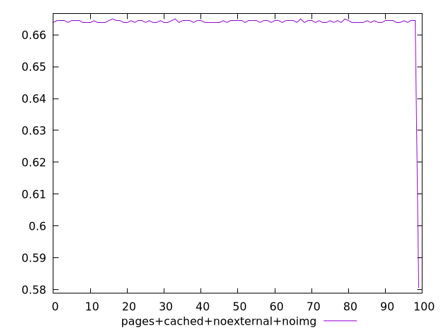
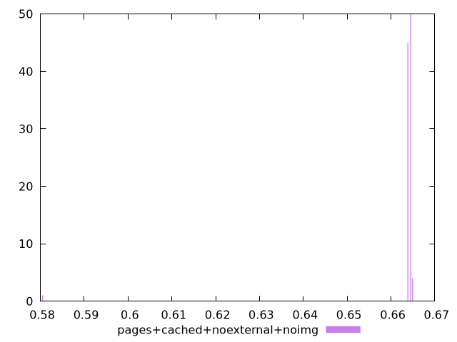
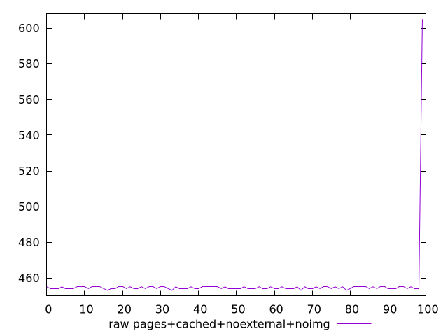
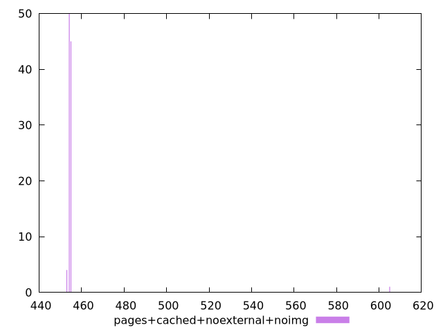

# Report pages+cached+noexternal+noimg

[parent..](./..)  


## Scores

  

## Score Histogram

  

## Score Indicators

```yaml
min: 0.5805555555555555
max: 0.665
range: 0.08444444444444454
mean: 0.6633777777777777
median: 0.6644444444444444
stdev: 0.00832988076626833
skewness: -9.827889008765435

```

## Raw Values

  

## Raw Values Histogram

  

## Raw Indicators

```yaml
min: 453
max: 605
range: 152
mean: 455.92
median: 454
stdev: 14.993785379282931
skewness: 9.827889008765553

```

<style>
  img {
    max-width: 80%;
  }
</style>
      
