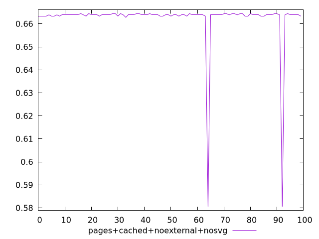
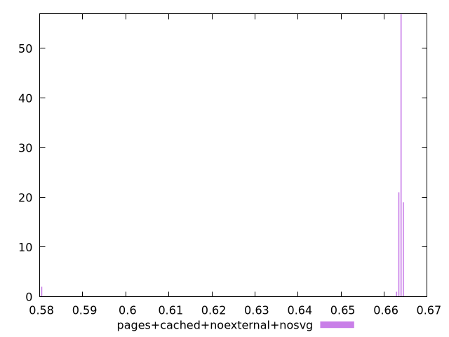
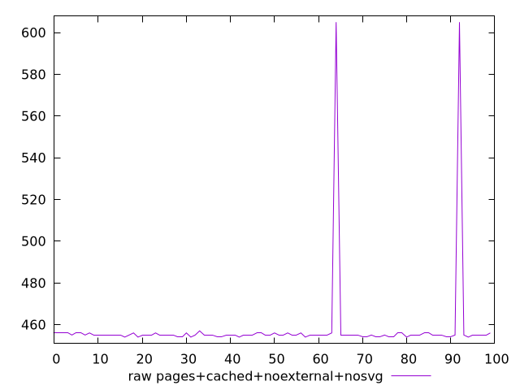
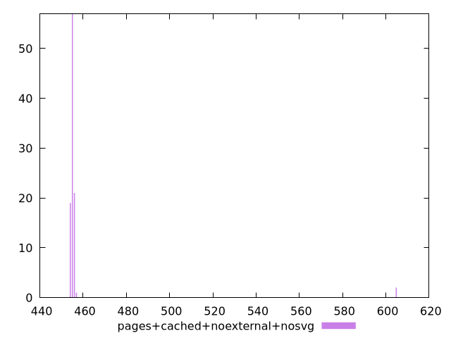

# Report pages+cached+noexternal+nosvg

[parent..](./..)  


## Scores

  

## Score Histogram

  

## Score Indicators

```yaml
min: 0.5805555555555555
max: 0.6644444444444444
range: 0.0838888888888889
mean: 0.6622000000000002
median: 0.6638888888888889
stdev: 0.011669290710193665
skewness: -6.846505064019599

```

## Raw Values

  

## Raw Values Histogram

  

## Raw Indicators

```yaml
min: 454
max: 605
range: 151
mean: 458.04
median: 455
stdev: 21.004723278348624
skewness: 6.846505064019493

```

<style>
  img {
    max-width: 80%;
  }
</style>
      
