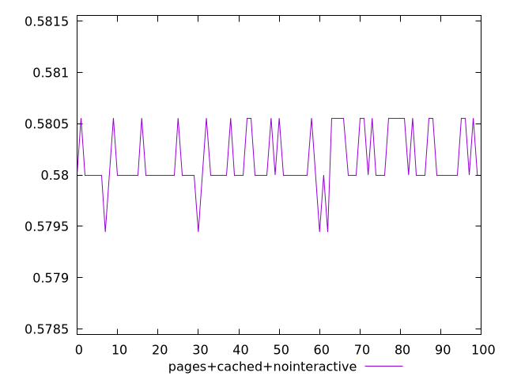
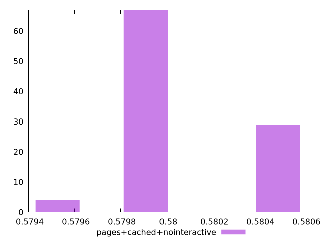
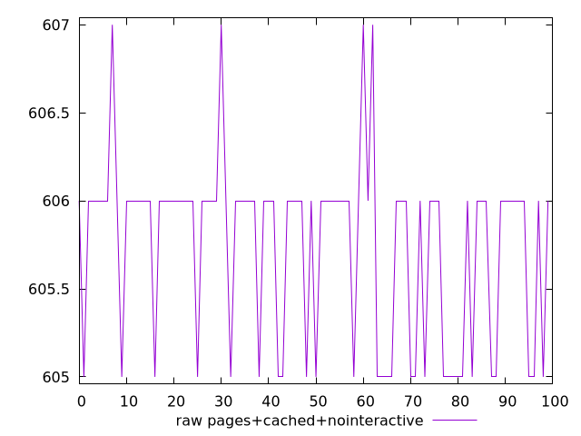
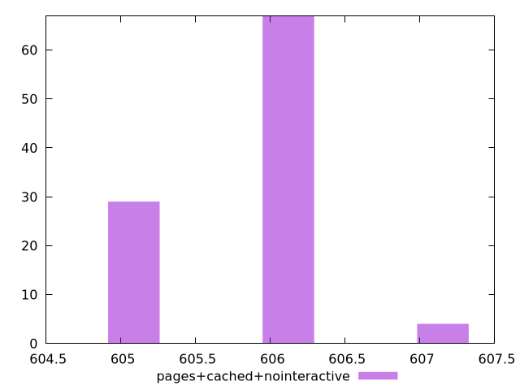

# Report pages+cached+nointeractive

[parent..](./..)  


## Scores

  

## Score Histogram

  

## Score Indicators

```yaml
min: 0.5794444444444444
max: 0.5805555555555555
range: 0.0011111111111110628
mean: 0.5801388888888881
median: 0.58
stdev: 0.0002873355675774487
skewness: 0.24394285238383226

```

## Raw Values

  

## Raw Values Histogram

  

## Raw Indicators

```yaml
min: 605
max: 607
range: 2
mean: 605.75
median: 606
stdev: 0.51720402163943
skewness: -0.24394285237600868

```

<style>
  img {
    max-width: 80%;
  }
</style>
      
