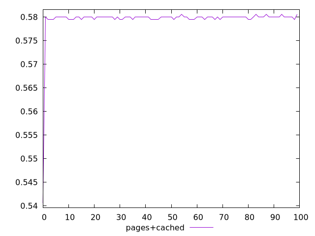
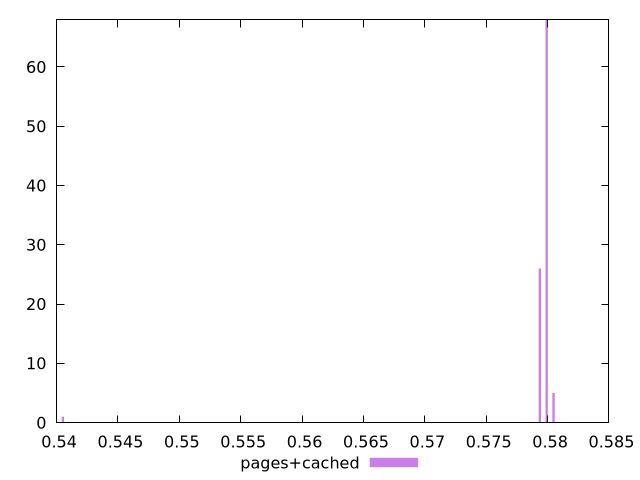
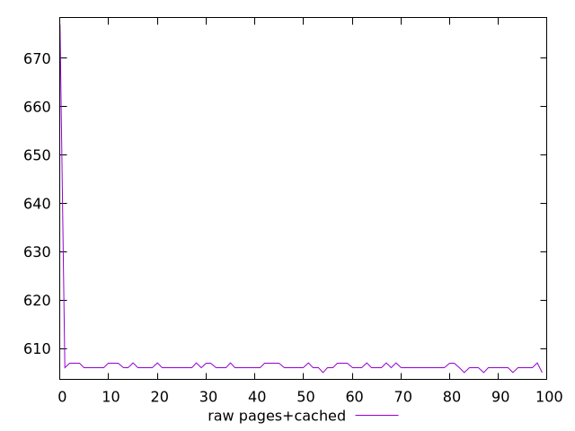
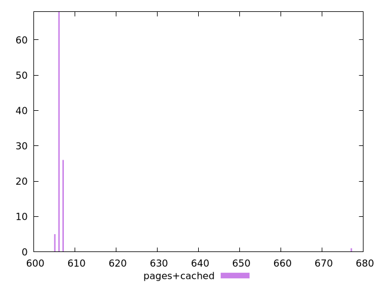

# Report pages+cached

[parent..](./..)  


## Scores

  

## Score Histogram

  

## Score Indicators

```yaml
min: 0.5405555555555556
max: 0.5805555555555555
range: 0.039999999999999925
mean: 0.5794888888888886
median: 0.58
stdev: 0.003923402403495344
skewness: -9.769328980062676

```

## Raw Values

  

## Raw Values Histogram

  

## Raw Indicators

```yaml
min: 605
max: 677
range: 72
mean: 606.92
median: 606
stdev: 7.062124326291629
skewness: 9.76932898006287

```

<style>
  img {
    max-width: 80%;
  }
</style>
      
