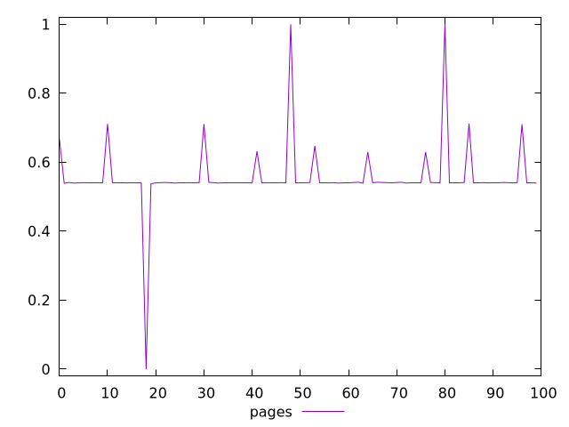
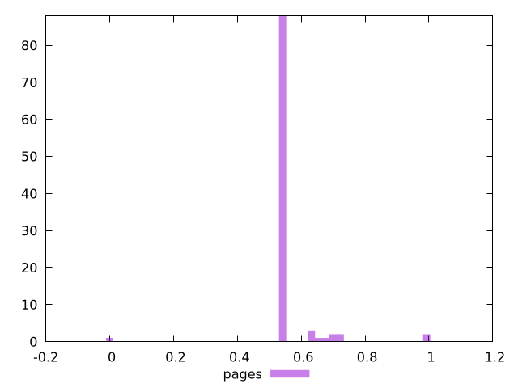
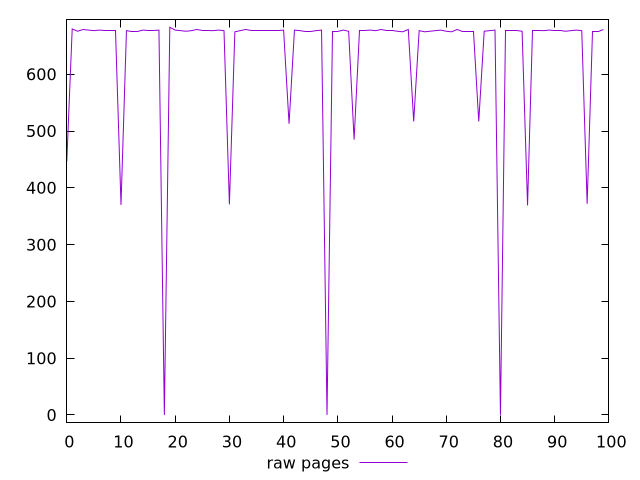
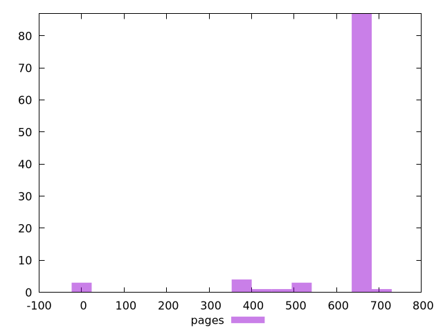

# Report pages

[parent..](./..)  


## Scores

  

## Score Histogram

  

## Score Indicators

```yaml
min: 0
max: 1
range: 1
mean: 0.5560777777777779
median: 0.5405555555555556
stdev: 0.0926344475030619
skewness: 0.26284287580419424

```

## Raw Values

  

## Raw Values Histogram

  

## Raw Indicators

```yaml
min: 0
max: 683
range: 683
mean: 635.56
median: 677
stdev: 132.175135331877
skewness: -3.696556878425596

```

<style>
  img {
    max-width: 80%;
  }
</style>
      
