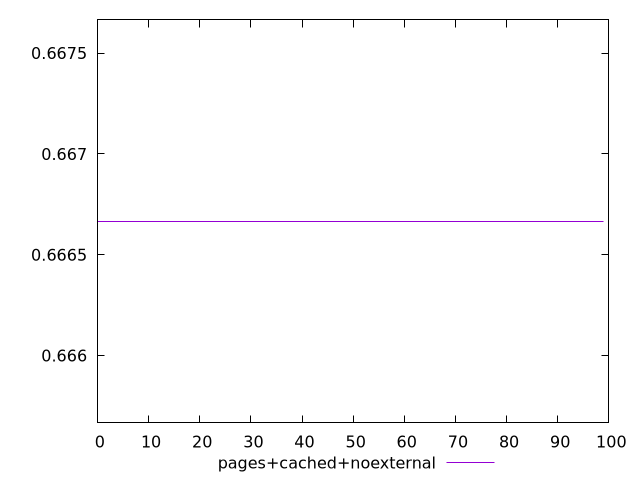
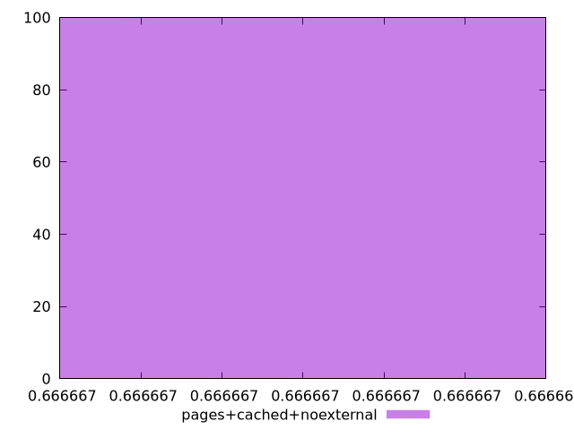
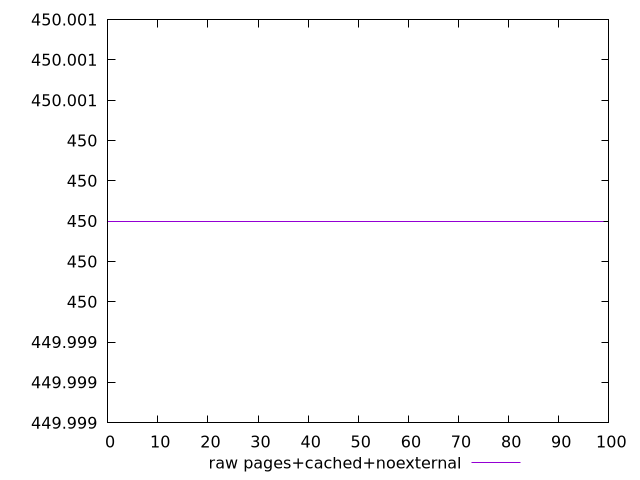
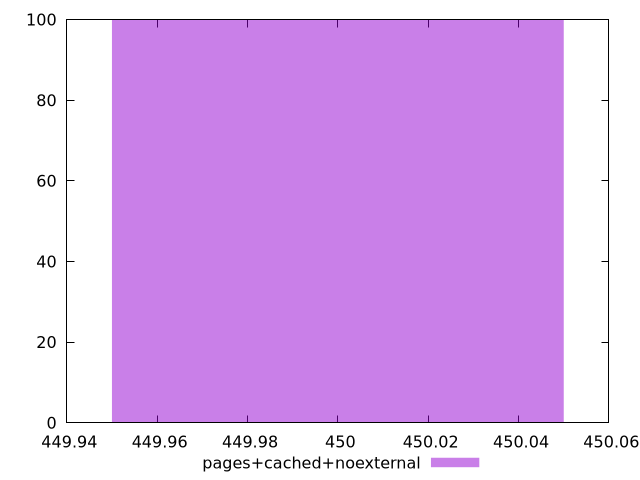

# Report pages+cached+noexternal

[parent..](./..)  


## Scores

  

## Score Histogram

  

## Score Indicators

```yaml
min: 0.6666666666666666
max: 0.6666666666666666
range: 0
mean: 0.6666666666666659
median: 0.6666666666666666
stdev: 7.771561172376096e-16
skewness: 1

```

## Raw Values

  

## Raw Values Histogram

  

## Raw Indicators

```yaml
min: 450
max: 450
range: 0
mean: 450
median: 450
stdev: 0
skewness: .nan

```

<style>
  img {
    max-width: 80%;
  }
</style>
      
