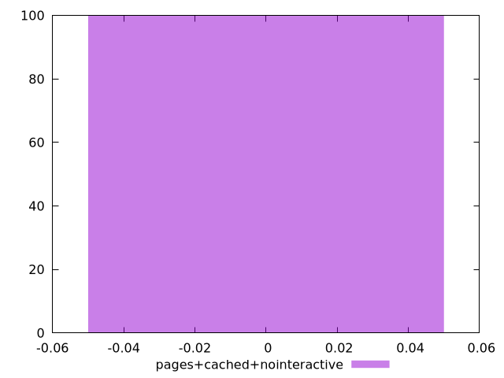

# Report pages+cached+nointeractive

[parent..](./..)  


## Scores

  

## Score Histogram

  

## Score Indicators

```yaml
min: 0
max: 0
range: 0
mean: 0
median: 0
stdev: 0
skewness: .nan

```

## Raw Values

  

## Raw Values Histogram

  

## Raw Indicators

```yaml
min: 5700
max: 5860
range: 160
mean: 5710.8
median: 5710
stdev: 15.276125163142636
skewness: 9.290586922452308

```

<style>
  img {
    max-width: 80%;
  }
</style>
      
