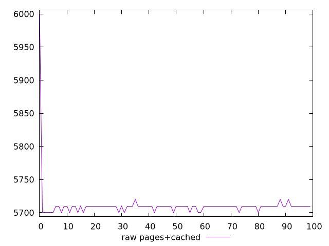
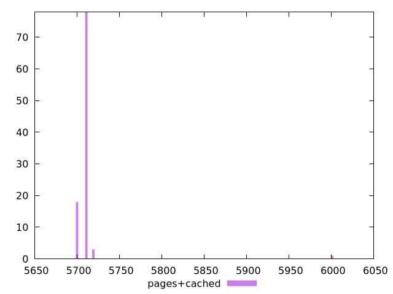

# Report pages+cached

[parent..](./..)  


## Scores

  

## Score Histogram

  

## Score Indicators

```yaml
min: 0
max: 0
range: 0
mean: 0
median: 0
stdev: 0
skewness: .nan

```

## Raw Values

  

## Raw Values Histogram

  

## Raw Indicators

```yaml
min: 5700
max: 6000
range: 300
mean: 5711.4
median: 5710
stdev: 29.32643858363985
skewness: 9.520495700765466

```

<style>
  img {
    max-width: 80%;
  }
</style>
      
