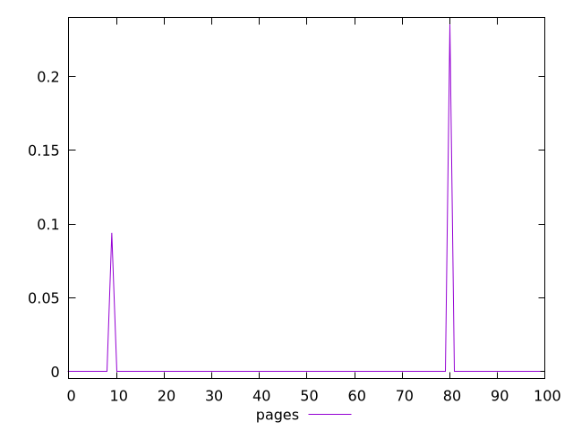
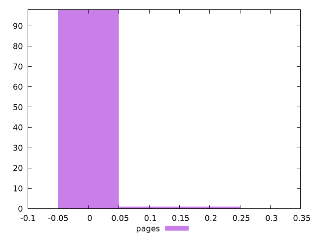
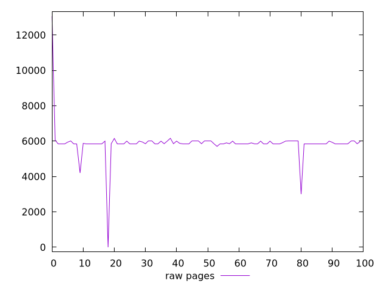
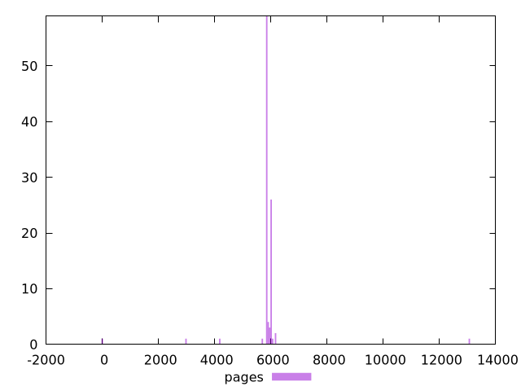

# Report pages

[parent..](./..)  


## Scores

  

## Score Histogram

  

## Score Indicators

```yaml
min: 0
max: 0.23529411764705882
range: 0.23529411764705882
mean: 0.0032941176470588237
median: 0
stdev: 0.025126944139694123
skewness: 8.34131857949278

```

## Raw Values

  

## Raw Values Histogram

  

## Raw Indicators

```yaml
min: 0
max: 13060
range: 13060
mean: 5870.4
median: 5850
stdev: 989.4472396242254
skewness: 1.4568942502479263

```

<style>
  img {
    max-width: 80%;
  }
</style>
      
