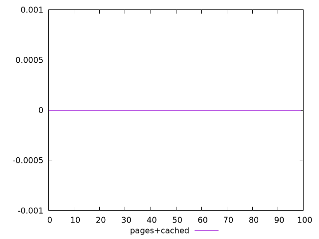
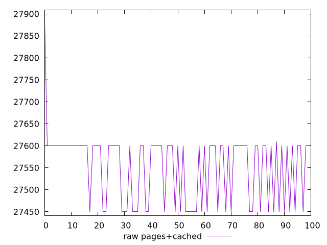
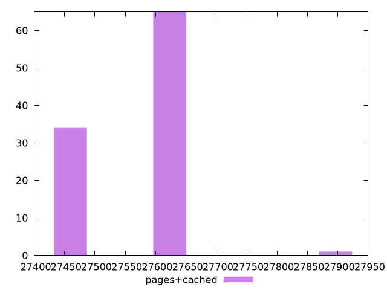

# Report pages+cached

[parent..](./..)  


## Scores

  

## Score Histogram

  

## Score Indicators

```yaml
min: 0
max: 0
range: 0
mean: 0
median: 0
stdev: 0
skewness: .nan

```

## Raw Values

  

## Raw Values Histogram

  

## Raw Indicators

```yaml
min: 27450
max: 27900
range: 450
mean: 27552.1
median: 27600
stdev: 79.09860934302196
skewness: 0.2656850372508557

```

<style>
  img {
    max-width: 80%;
  }
</style>
      
