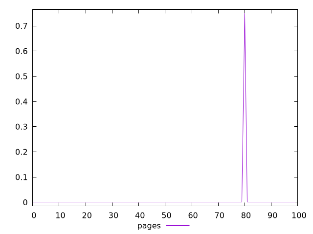
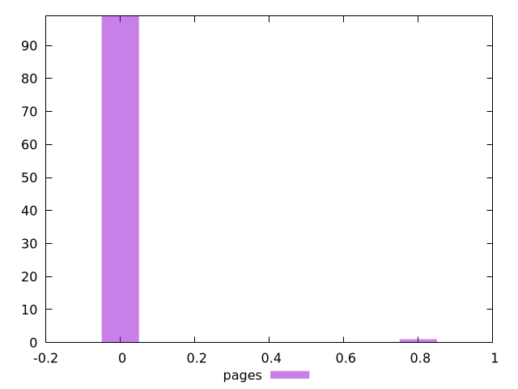
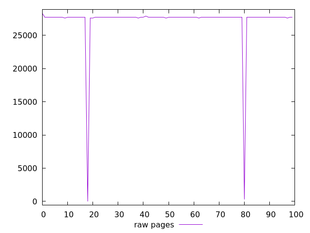
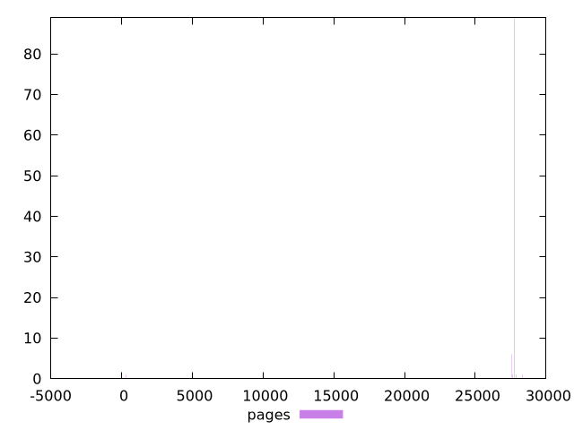

# Report pages

[parent..](./..)  


## Scores

  

## Score Histogram

  

## Score Indicators

```yaml
min: 0
max: 0.75
range: 0.75
mean: 0.0075
median: 0
stdev: 0.0746240577829964
skewness: 9.849370589540326

```

## Raw Values

  

## Raw Values Histogram

  

## Raw Indicators

```yaml
min: 0
max: 28330
range: 28330
mean: 27194.9
median: 27750
stdev: 3864.2785859717715
skewness: -6.853757382777844

```

<style>
  img {
    max-width: 80%;
  }
</style>
      
