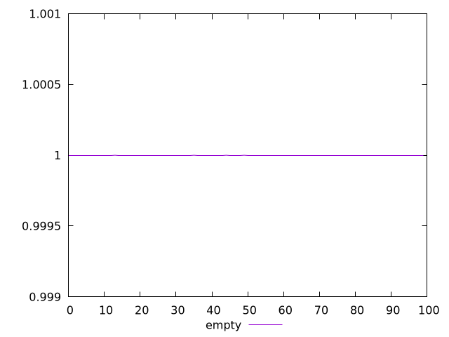
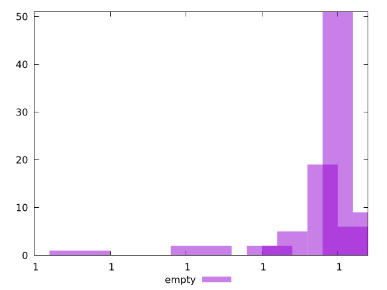
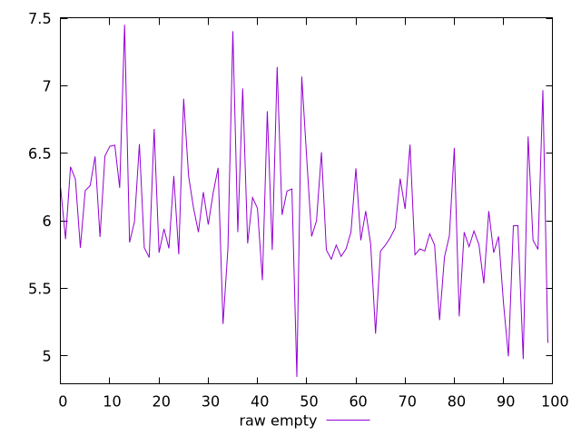
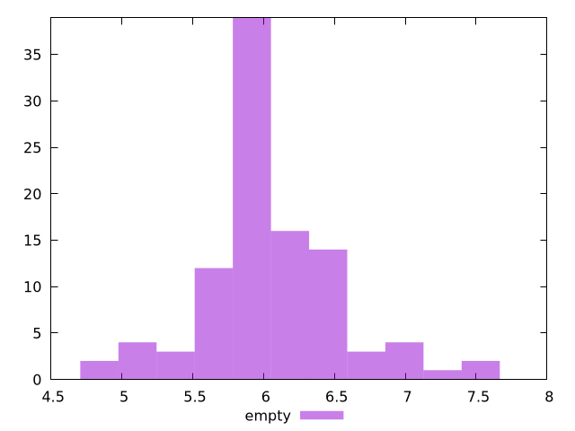

# Report empty

[parent..](./..)  


## Scores

  

## Score Histogram

  

## Score Indicators

```yaml
min: 0.9999999999999979
max: 1
range: 2.1094237467877974e-15
mean: 0.9999999999999999
median: 0.9999999999999998
stdev: 4.176268858247851e-16
skewness: -3.0422342829153433
eccentricity: 0.22744902159317754
quanta: 13
quantaRatio: 0.13
p90range: 5.551115123125783e-16
p90stdev: 0.9999999999999998
p90eccentricity: 0.22744902159317754
p90quanta: 6
p90quantaRatio: 0.06666666666666667
outlandishness: 1

```

## Raw Values

  

## Raw Values Histogram

  

## Raw Indicators

```yaml
min: 4.844000000000001
max: 7.452000000000001
range: 2.6079999999999997
mean: 6.035160000000001
median: 5.916000000000001
stdev: 0.48213933089927424
skewness: 0.411872116856753
eccentricity: 1.455678794532155
quanta: 91
quantaRatio: 0.91
p90range: 1.7399999999999993
p90stdev: 5.916000000000001
p90eccentricity: 1.455678794532155
p90quanta: 81
p90quantaRatio: 0.9
outlandishness: 1.0095396171825308

```

<style>
  img {
    max-width: 80%;
  }
</style>
      
