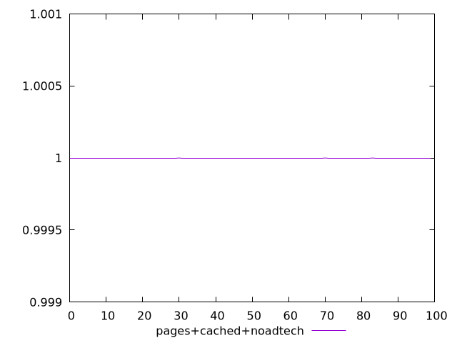
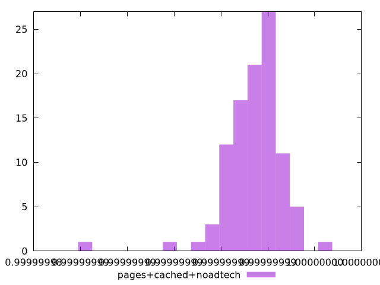
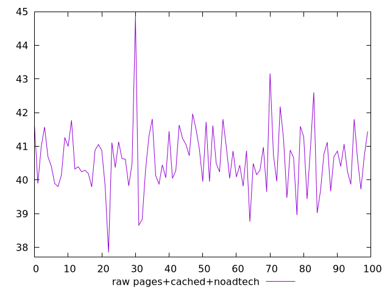
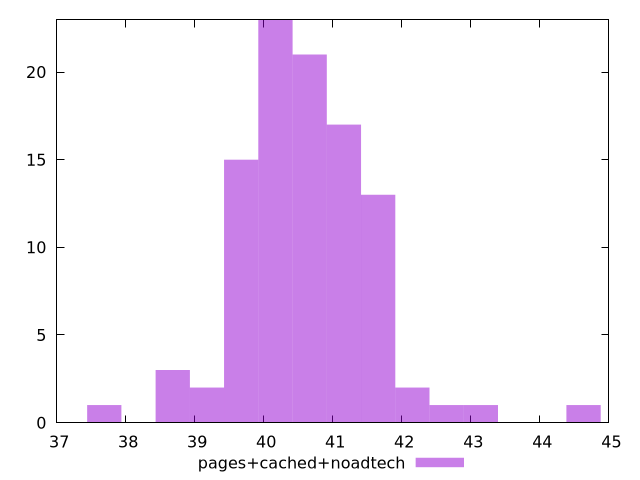

# Report pages+cached+noadtech

[parent..](./..)  


## Scores

  

## Score Histogram

  

## Score Indicators

```yaml
min: 0.9999999864588494
max: 0.9999999961731936
range: 9.714344217925941e-9
mean: 0.9999999934021548
median: 0.9999999934903822
stdev: 1.2374770912594187e-9
skewness: -1.9048530346453152
eccentricity: 1.3897398396082599
quanta: 94
quantaRatio: 0.94
p90range: 3.0822642216321583e-9
p90stdev: 0.9999999934808019
p90eccentricity: 1.3897398396082599
p90quanta: 84
p90quantaRatio: 0.9333333333333333
outlandishness: 0.9999999999380076

```

## Raw Values

  

## Raw Values Histogram

  

## Raw Indicators

```yaml
min: 37.848
max: 44.85199999999999
range: 7.003999999999991
mean: 40.61956
median: 40.617999999999995
stdev: 0.95284700052002
skewness: 0.696081286541597
eccentricity: 1.4777608569177767
quanta: 100
quantaRatio: 1
p90range: 2.5320000000000107
p90stdev: 40.62599999999999
p90eccentricity: 1.4777608569177767
p90quanta: 90
p90quantaRatio: 1
outlandishness: 0.9992719037023919

```

<style>
  img {
    max-width: 80%;
  }
</style>
      
