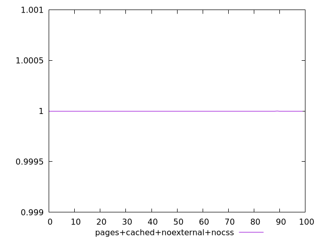
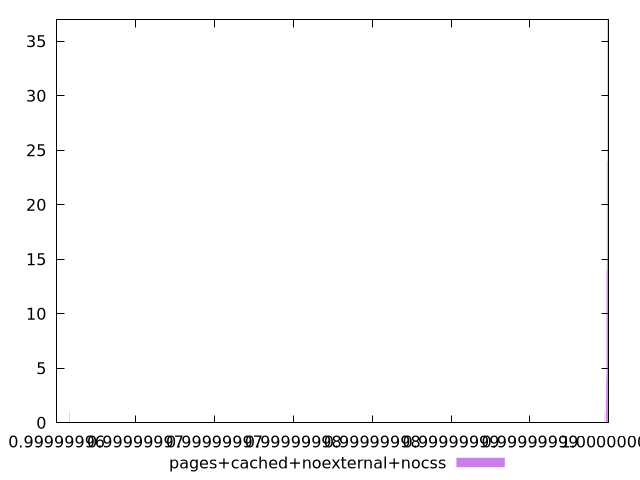
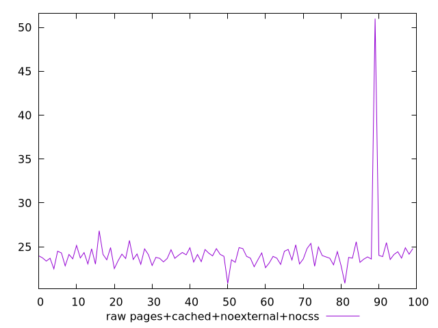
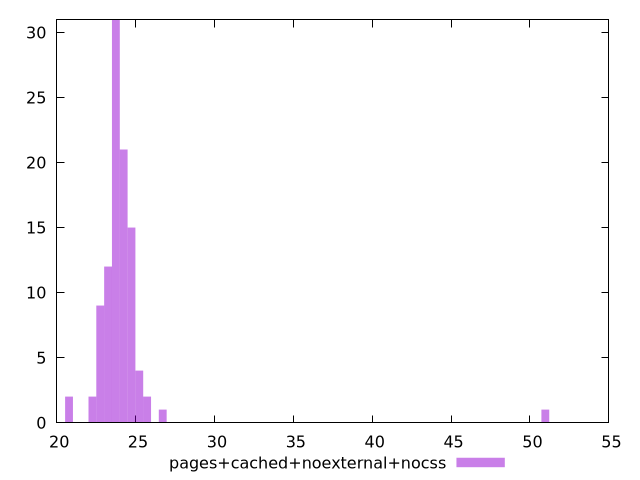

# Report pages+cached+noexternal+nocss

[parent..](./..)  


## Scores

  

## Score Histogram

  

## Score Indicators

```yaml
min: 0.9999999658439884
max: 0.9999999999689404
range: 3.412495197530063e-8
mean: 0.9999999995561387
median: 0.9999999999017992
stdev: 3.388347104980281e-9
skewness: -9.848050143980908
eccentricity: 0.21433533462559887
quanta: 93
quantaRatio: 0.93
p90range: 1.8793366862723815e-10
p90stdev: 0.9999999998992397
p90eccentricity: 0.21433533462559887
p90quanta: 83
p90quantaRatio: 0.9222222222222223
outlandishness: 0.999999999328204

```

## Raw Values

  

## Raw Values Histogram

  

## Raw Indicators

```yaml
min: 20.81599999999999
max: 50.99599999999998
range: 30.179999999999993
mean: 24.170479999999994
median: 23.865999999999993
stdev: 2.8353475006778255
skewness: 8.432141156923793
eccentricity: 0.6429123765479242
quanta: 99
quantaRatio: 0.99
p90range: 2.6960000000000086
p90stdev: 23.89599999999999
p90eccentricity: 0.6429123765479242
p90quanta: 89
p90quantaRatio: 0.9888888888888889
outlandishness: 1.0180996457494031

```

<style>
  img {
    max-width: 80%;
  }
</style>
      
