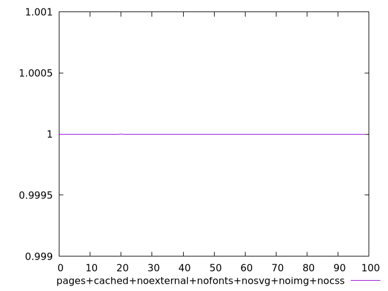
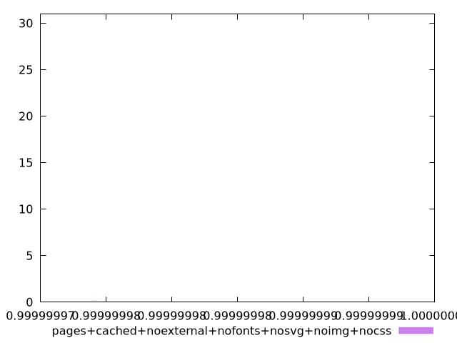
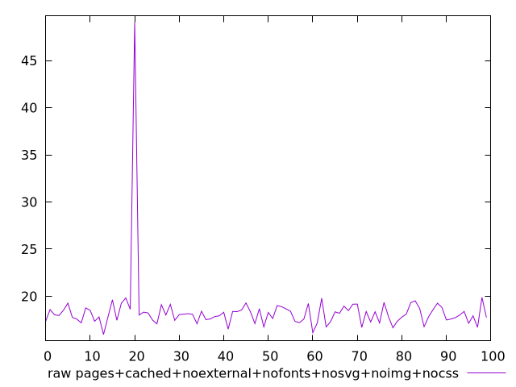
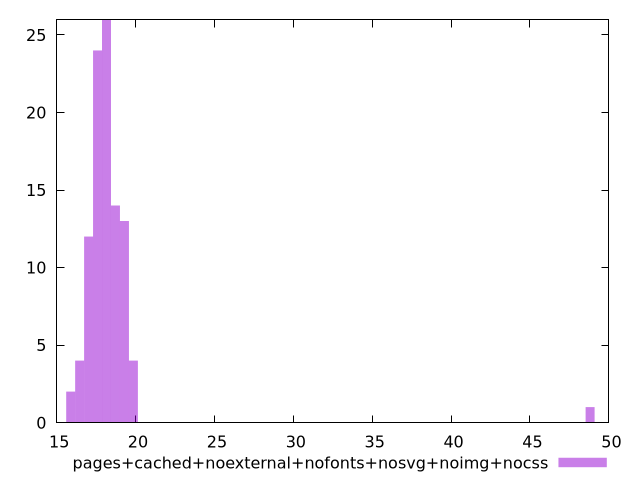

# Report pages+cached+noexternal+nofonts+nosvg+noimg+nocss

[parent..](./..)  


## Scores

  

## Score Histogram

  

## Score Indicators

```yaml
min: 0.9999999739957541
max: 0.9999999999969724
range: 2.600121828955082e-8
mean: 0.9999999997302029
median: 0.9999999999908423
stdev: 2.586412505720248e-9
skewness: -9.849334611278756
eccentricity: 0.2034400024207016
quanta: 95
quantaRatio: 0.95
p90range: 1.537225902126238e-11
p90stdev: 0.9999999999903706
p90eccentricity: 0.2034400024207016
p90quanta: 85
p90quantaRatio: 0.9444444444444444
outlandishness: 0.999999999481233

```

## Raw Values

  

## Raw Values Histogram

  

## Raw Indicators

```yaml
min: 15.947999999999993
max: 49.08399999999998
range: 33.13599999999999
mean: 18.3854
median: 18.071999999999992
stdev: 3.199191816693709
skewness: 8.813955633284401
eccentricity: 0.6214819597953329
quanta: 97
quantaRatio: 0.97
p90range: 2.8000000000000043
p90stdev: 18.17599999999999
p90eccentricity: 0.6214819597953329
p90quanta: 87
p90quantaRatio: 0.9666666666666667
outlandishness: 1.0173595816562984

```

<style>
  img {
    max-width: 80%;
  }
</style>
      
