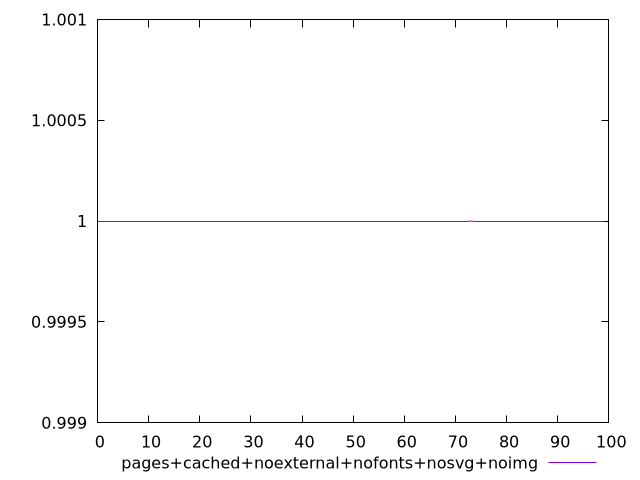
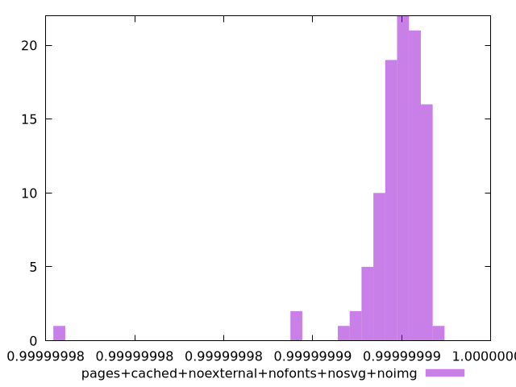
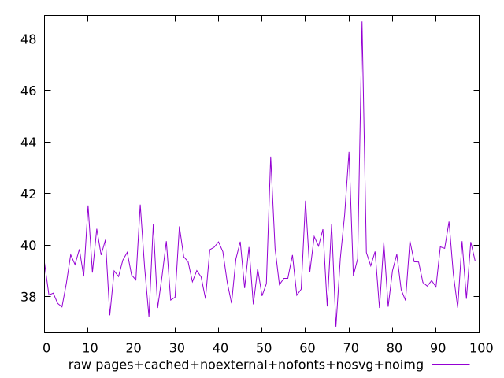
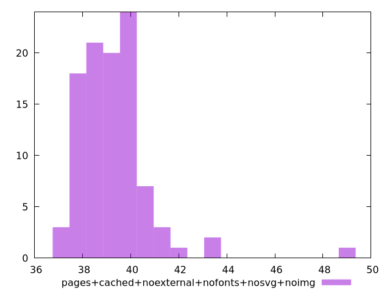

# Report pages+cached+noexternal+nofonts+nosvg+noimg

[parent..](./..)  


## Scores

  

## Score Histogram

  

## Score Indicators

```yaml
min: 0.9999999754924316
max: 0.9999999968854432
range: 2.1393011584436294e-8
mean: 0.9999999946799969
median: 0.9999999950312332
stdev: 2.3291062991666045e-9
skewness: -5.834430142688571
eccentricity: 0.9647304333832433
quanta: 95
quantaRatio: 0.95
p90range: 3.2600725452525126e-9
p90stdev: 0.999999995152023
p90eccentricity: 0.9647304333832433
p90quanta: 85
p90quantaRatio: 0.9444444444444444
outlandishness: 0.9999999992541349

```

## Raw Values

  

## Raw Values Histogram

  

## Raw Indicators

```yaml
min: 36.83599999999999
max: 48.67999999999998
range: 11.843999999999987
mean: 39.313959999999994
median: 39.17999999999999
stdev: 1.5313358868647984
skewness: 2.6014163421210634
eccentricity: 1.3422528771321565
quanta: 98
quantaRatio: 0.98
p90range: 3.352000000000018
p90stdev: 39.05199999999999
p90eccentricity: 1.3422528771321565
p90quanta: 88
p90quantaRatio: 0.9777777777777777
outlandishness: 1.0113811153674113

```

<style>
  img {
    max-width: 80%;
  }
</style>
      
