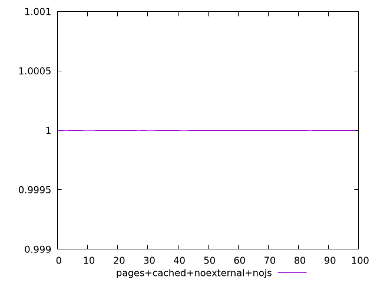
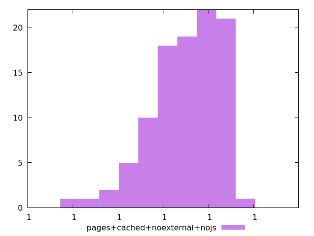
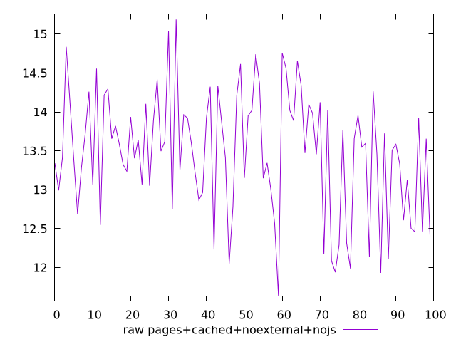
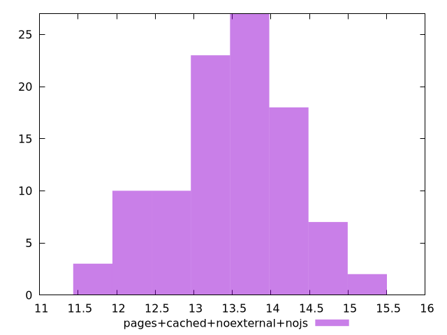

# Report pages+cached+noexternal+nojs

[parent..](./..)  


## Scores

  

## Score Histogram

  

## Score Indicators

```yaml
min: 0.9999999999980482
max: 0.999999999999833
range: 1.7847945343874017e-12
mean: 0.9999999999992637
median: 0.9999999999993032
stdev: 3.708001655780867e-13
skewness: -0.7667893986125407
eccentricity: 1.5701205343470284
quanta: 95
quantaRatio: 0.95
p90range: 1.0050849041931542e-12
p90stdev: 0.9999999999993501
p90eccentricity: 1.5701205343470284
p90quanta: 85
p90quantaRatio: 0.9444444444444444
outlandishness: 0.9999999999998541

```

## Raw Values

  

## Raw Values Histogram

  

## Raw Indicators

```yaml
min: 11.64
max: 15.188000000000002
range: 3.548000000000002
mean: 13.473159999999998
median: 13.566
stdev: 0.7878814723040514
skewness: -0.2680699134273648
eccentricity: 1.6080591364776495
quanta: 98
quantaRatio: 0.98
p90range: 2.615999999999998
p90stdev: 13.591999999999999
p90eccentricity: 1.6080591364776495
p90quanta: 88
p90quantaRatio: 0.9777777777777777
outlandishness: 0.9903204281760343

```

<style>
  img {
    max-width: 80%;
  }
</style>
      
