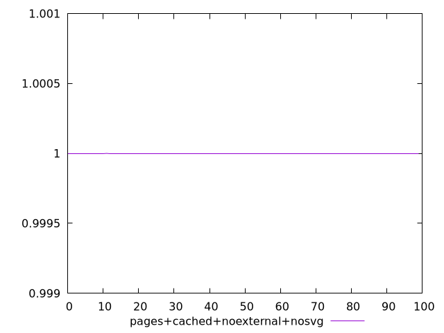

# Report pages+cached+noexternal+nosvg

[parent..](./..)  


## Scores

  

## Score Histogram

  

## Score Indicators

```yaml
min: 0.9999999602657192
max: 0.9999999968335389
range: 3.656781966121514e-8
mean: 0.9999999948476757
median: 0.9999999953468575
stdev: 3.5770158350512052e-9
skewness: -9.033100635212795
eccentricity: 0.5487609165116638
quanta: 97
quantaRatio: 0.97
p90range: 2.807852950148515e-9
p90stdev: 0.9999999953468575
p90eccentricity: 0.5487609165116638
p90quanta: 87
p90quantaRatio: 0.9666666666666667
outlandishness: 0.9999999992247404

```

## Raw Values

  

## Raw Values Histogram

  

## Raw Indicators

```yaml
min: 36.91599999999999
max: 52.095999999999975
range: 15.179999999999986
mean: 39.07191999999999
median: 38.83999999999999
stdev: 1.5721132763258492
skewness: 5.71145852358681
eccentricity: 1.024150119616612
quanta: 99
quantaRatio: 0.99
p90range: 2.8079999999999927
p90stdev: 38.829999999999984
p90eccentricity: 1.024150119616612
p90quanta: 89
p90quantaRatio: 0.9888888888888889
outlandishness: 1.0093751932311645

```

<style>
  img {
    max-width: 80%;
  }
</style>
      
