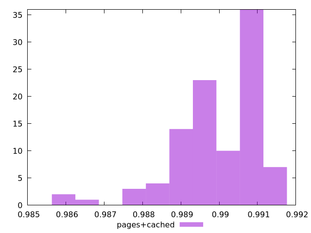

# Report pages+cached

[parent..](./..)  


## Scores

  

## Score Histogram

  

## Score Indicators

```yaml
min: 0.9856639742075987
max: 0.9915786630371468
range: 0.005914688829548154
mean: 0.9899659944685201
median: 0.9902597407611234
stdev: 0.0011445477501016567
skewness: -1.3454072956021859
eccentricity: 1.5750634890367732
quanta: 100
quantaRatio: 1
p90range: 0.0027621557522351514
p90stdev: 0.990371578487772
p90eccentricity: 1.5750634890367732
p90quanta: 90
p90quantaRatio: 1
outlandishness: 0.9995823995742971

```

## Raw Values

  

## Raw Values Histogram

  

## Raw Indicators

```yaml
min: 537.7520000000004
max: 630.0680000000001
range: 92.31599999999969
mean: 565.29152
median: 560.9620000000002
stdev: 18.344657496110422
skewness: 1.1244450353797455
eccentricity: 1.6160170886965455
quanta: 100
quantaRatio: 1
p90range: 45.928000000000225
p90stdev: 559.0680000000003
p90eccentricity: 1.6160170886965455
p90quanta: 90
p90quantaRatio: 1
outlandishness: 1.0113082954032468

```

<style>
  img {
    max-width: 80%;
  }
</style>
      
