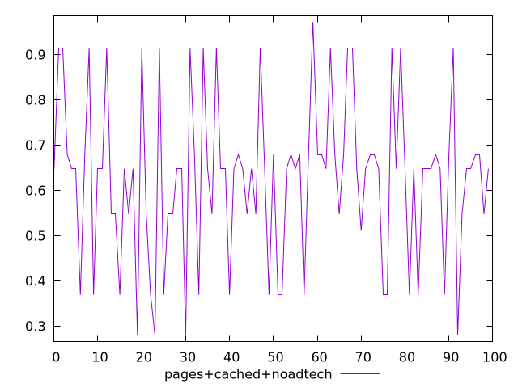
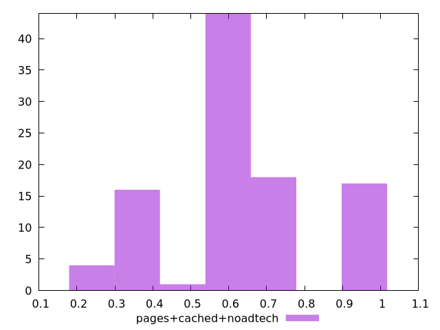
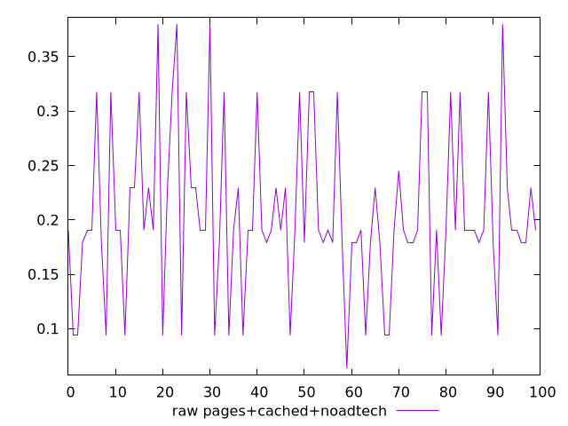
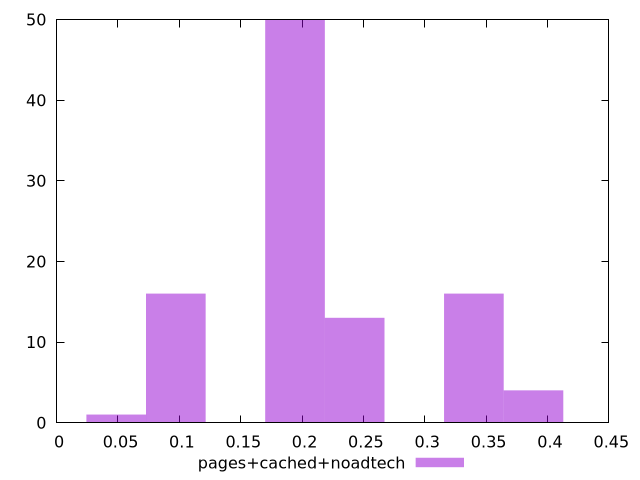

# Report pages+cached+noadtech

[parent..](./..)  


## Scores

  

## Score Histogram

  

## Score Indicators

```yaml
min: 0.27931295209719315
max: 0.9721147685558164
range: 0.6928018164586232
mean: 0.6266888717565642
median: 0.6478936866255779
stdev: 0.17729381649883694
skewness: -0.040475967631495566
eccentricity: 1.4025307460399021
quanta: 8
quantaRatio: 0.08
p90range: 0.5455857822893553
p90stdev: 0.6478936866255779
p90eccentricity: 1.4025307460399021
p90quanta: 6
p90quantaRatio: 0.06666666666666667
outlandishness: 1.0141818032537948

```

## Raw Values

  

## Raw Values Histogram

  

## Raw Indicators

```yaml
min: 0.0636767578125
max: 0.3797997665405274
range: 0.3161230087280274
mean: 0.2048877314567566
median: 0.1905707836151123
stdev: 0.07548255962971656
skewness: 0.4510825656241647
eccentricity: 1.374724873864476
quanta: 8
quantaRatio: 0.08
p90range: 0.22363338470458988
p90stdev: 0.1905707836151123
p90eccentricity: 1.374724873864476
p90quanta: 6
p90quantaRatio: 0.06666666666666667
outlandishness: 1.1337135979562916

```

<style>
  img {
    max-width: 80%;
  }
</style>
      
