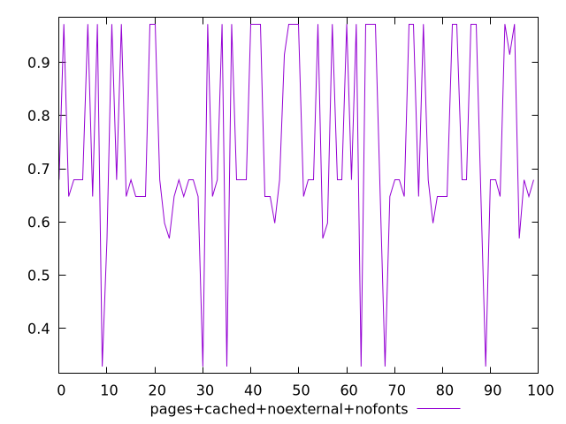
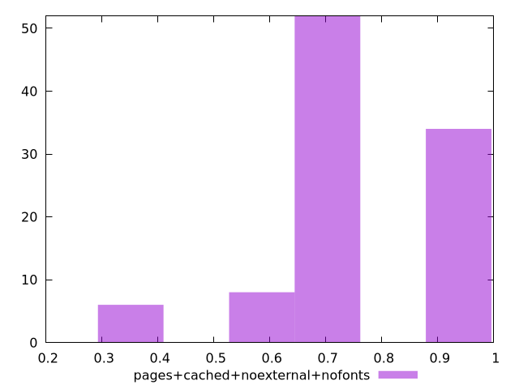
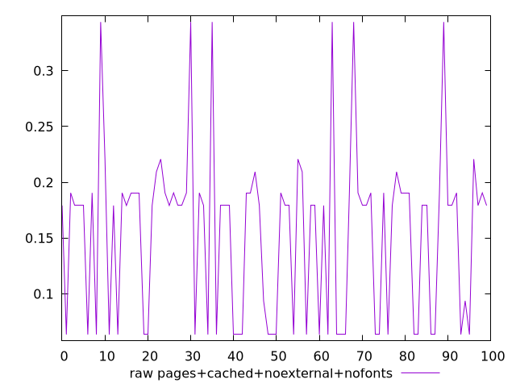
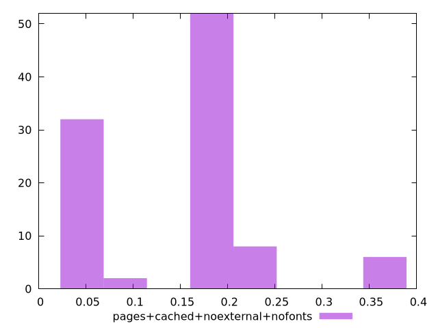

# Report pages+cached+noexternal+nofonts

[parent..](./..)  


## Scores

  

## Score Histogram

  

## Score Indicators

```yaml
min: 0.3282051435542629
max: 0.9721147685558164
range: 0.6439096250015535
mean: 0.7417266633466181
median: 0.6792219852973744
stdev: 0.18172070532009413
skewness: -0.13533818295343775
eccentricity: 1.4787956589104778
quanta: 7
quantaRatio: 0.07
p90range: 0.4030797085573038
p90stdev: 0.6792219852973744
p90eccentricity: 1.4787956589104778
p90quanta: 6
p90quantaRatio: 0.06666666666666667
outlandishness: 0.9548627598222021

```

## Raw Values

  

## Raw Values Histogram

  

## Raw Indicators

```yaml
min: 0.0636767578125
max: 0.3436212158203125
range: 0.27994445800781254
mean: 0.15588401346206668
median: 0.17922065734863282
stdev: 0.07503340771799585
skewness: 0.40649996103807384
eccentricity: 1.4400338115753597
quanta: 7
quantaRatio: 0.07
p90range: 0.15709116935729978
p90stdev: 0.17922065734863282
p90eccentricity: 1.4400338115753597
p90quanta: 6
p90quantaRatio: 0.06666666666666667
outlandishness: 1.117422955286033

```

<style>
  img {
    max-width: 80%;
  }
</style>
      
