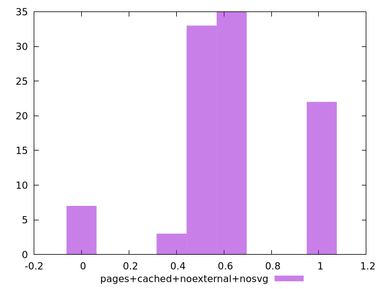

# Report pages+cached+noexternal+nosvg

[parent..](./..)  


## Scores

  

## Score Histogram

  

## Score Indicators

```yaml
min: 0.01659363310226647
max: 0.9638914552234408
range: 0.9472978221211743
mean: 0.6248702206517164
median: 0.6085969600017687
stdev: 0.23298883950524024
skewness: -0.6001691790248802
eccentricity: 1.2648789153164366
quanta: 7
quantaRatio: 0.07
p90range: 0.5511460719498273
p90stdev: 0.6085969600017687
p90eccentricity: 1.2648789153164366
p90quanta: 6
p90quantaRatio: 0.06666666666666667
outlandishness: 0.8939938901857052

```

## Raw Values

  

## Raw Values Histogram

  

## Raw Indicators

```yaml
min: 0.0691375732421875
max: 1.1462412516276042
range: 1.0771036783854167
mean: 0.24965212898254394
median: 0.20527796427408854
stdev: 0.25394227598517377
skewness: 2.9992938642933042
eccentricity: 0.8429403406687918
quanta: 7
quantaRatio: 0.07
p90range: 0.22355037689208984
p90stdev: 0.20527796427408854
p90eccentricity: 0.8429403406687918
p90quanta: 6
p90quantaRatio: 0.06666666666666667
outlandishness: 1.8028112287023783

```

<style>
  img {
    max-width: 80%;
  }
</style>
      
