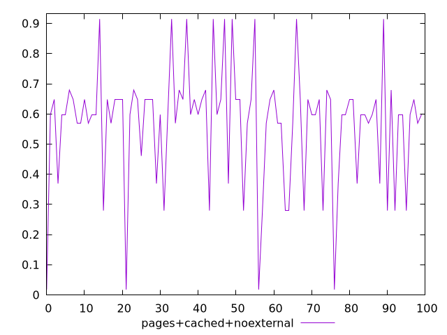
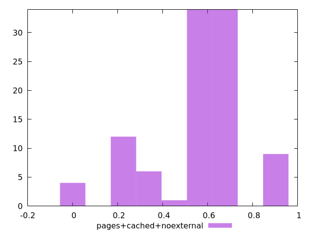
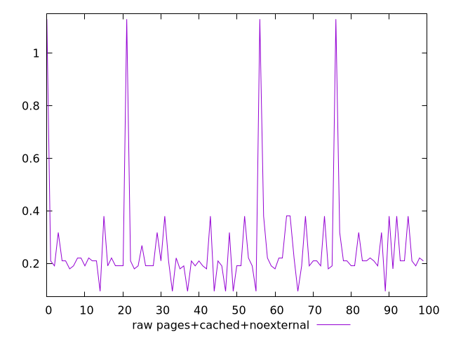
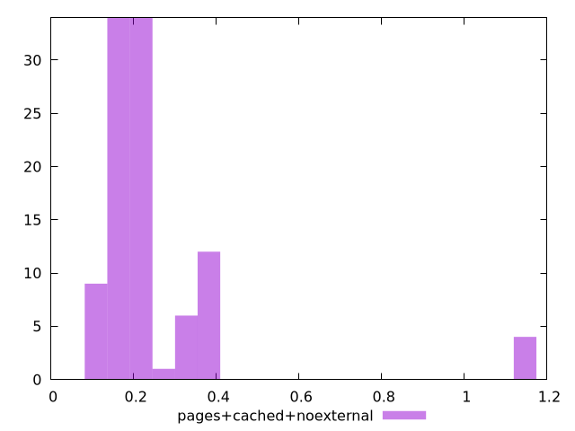

# Report pages+cached+noexternal

[parent..](./..)  


## Scores

  

## Score Histogram

  

## Score Indicators

```yaml
min: 0.017481246450500643
max: 0.9146517814122077
range: 0.8971705349617071
mean: 0.5655700440945245
median: 0.5978316776798642
stdev: 0.19546809248126926
skewness: -0.7736920631684377
eccentricity: 1.3067849441108919
quanta: 9
quantaRatio: 0.09
p90range: 0.6353388293150146
p90stdev: 0.5978316776798642
p90eccentricity: 1.3067849441108919
p90quanta: 8
p90quantaRatio: 0.08888888888888889
outlandishness: 0.9961657858203418

```

## Raw Values

  

## Raw Values Histogram

  

## Raw Indicators

```yaml
min: 0.0938739013671875
max: 1.1291448974609375
range: 1.03527099609375
mean: 0.25748740968704215
median: 0.20941780090332032
stdev: 0.19266869608175302
skewness: 3.661092352514066
eccentricity: 0.8644113115104082
quanta: 9
quantaRatio: 0.09
p90range: 0.2859258651733399
p90stdev: 0.20941780090332032
p90eccentricity: 0.8644113115104082
p90quanta: 8
p90quantaRatio: 0.08888888888888889
outlandishness: 1.2570759917809837

```

<style>
  img {
    max-width: 80%;
  }
</style>
      
