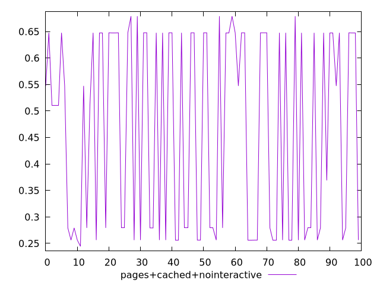
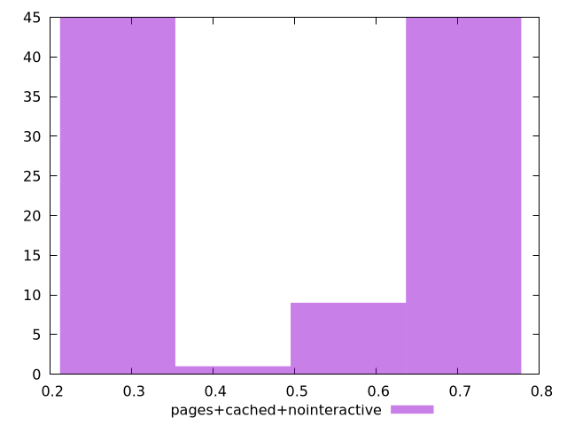
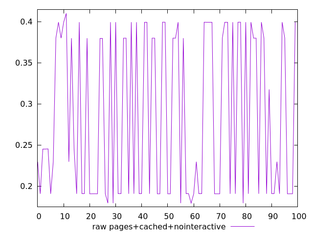
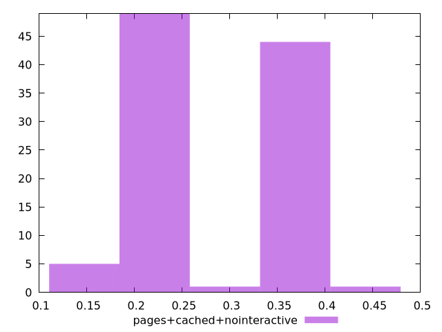

# Report pages+cached+nointeractive

[parent..](./..)  


## Scores

  

## Score Histogram

  

## Score Indicators

```yaml
min: 0.24447509805739986
max: 0.679138324734899
range: 0.4346632266774991
mean: 0.46391667879568843
median: 0.529112240538459
stdev: 0.18491324429725045
skewness: -0.08797065238862835
eccentricity: 1.9141071540535772
quanta: 54
quantaRatio: 0.54
p90range: 0.39157319835033955
p90stdev: 0.529112240538459
p90eccentricity: 1.9141071540535772
p90quanta: 47
p90quantaRatio: 0.5222222222222223
outlandishness: 1.001248617758143

```

## Raw Values

  

## Raw Values Histogram

  

## Raw Indicators

```yaml
min: 0.1792506052652995
max: 0.41002414533827036
range: 0.23077354007297085
mean: 0.2859499341710407
median: 0.23739460574256055
stdev: 0.09757025016379603
skewness: 0.13748359866963816
eccentricity: 1.897703978782937
quanta: 54
quantaRatio: 0.54
p90range: 0.22001781611972376
p90stdev: 0.21009897009531664
p90eccentricity: 1.897703978782937
p90quanta: 47
p90quantaRatio: 0.5222222222222223
outlandishness: 1.0952133218706555

```

<style>
  img {
    max-width: 80%;
  }
</style>
      
