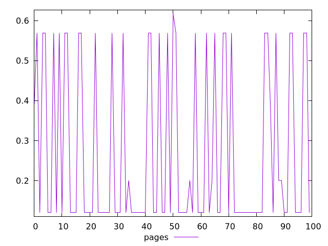
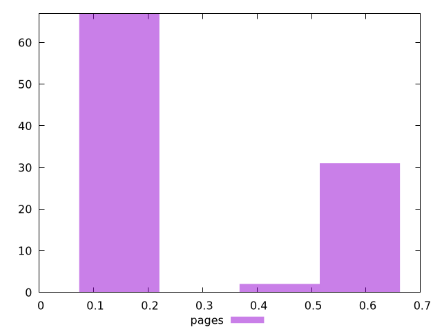
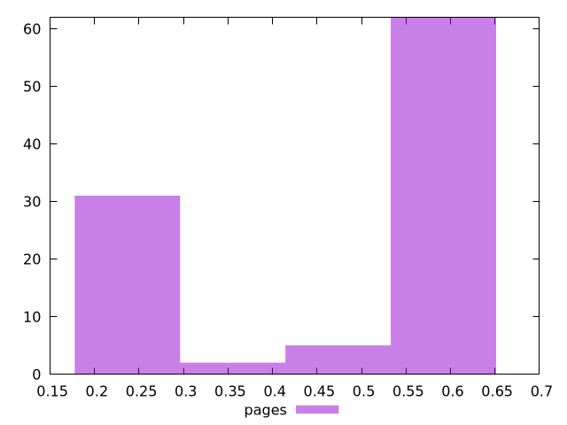

# Report pages

[parent..](./..)  


## Scores

  

## Score Histogram

  

## Score Indicators

```yaml
min: 0.12011090399475044
max: 0.616559429273424
range: 0.49644852527867356
mean: 0.2691658441976626
median: 0.1201259912813884
stdev: 0.20607642972241316
skewness: 0.7390146771246842
eccentricity: 1.4464941610515996
quanta: 45
quantaRatio: 0.45
p90range: 0.4488409621683863
p90stdev: 0.12012538774702203
p90eccentricity: 1.4464941610515996
p90quanta: 42
p90quantaRatio: 0.4666666666666667
outlandishness: 1.3082653368359167

```

## Raw Values

  

## Raw Values Histogram

  

## Raw Indicators

```yaml
min: 0.20224875195821124
max: 0.5789194452497695
range: 0.3766706932915582
mean: 0.4560575432120427
median: 0.5788882495032416
stdev: 0.16449584855838373
skewness: -0.6715550828895464
eccentricity: 1.4935288175334476
quanta: 45
quantaRatio: 0.45
p90range: 0.3581180979410808
p90stdev: 0.5788894973331027
p90eccentricity: 1.4935288175334476
p90quanta: 42
p90quantaRatio: 0.4666666666666667
outlandishness: 0.8937554403954004

```

<style>
  img {
    max-width: 80%;
  }
</style>
      
