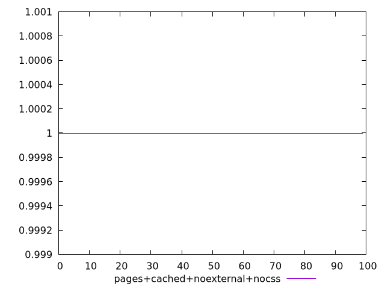
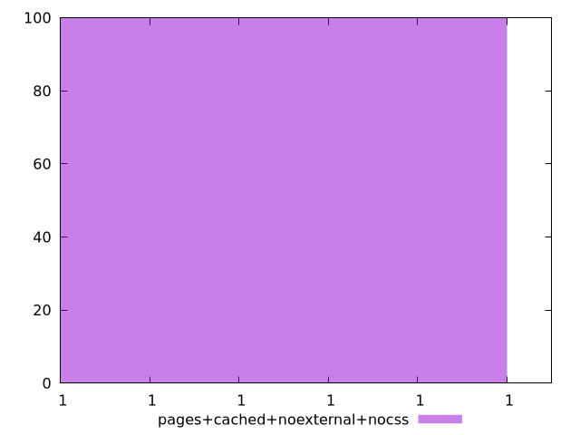
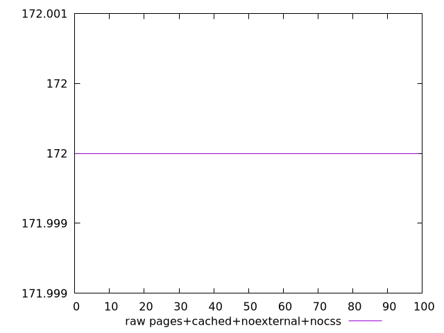
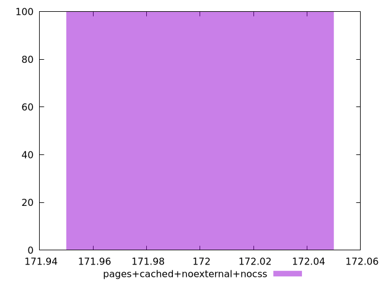

# Report pages+cached+noexternal+nocss

[parent..](./..)  


## Scores

  

## Score Histogram

  

## Score Indicators

```yaml
min: 0.9999997135746177
max: 0.9999997135746177
range: 0
mean: 0.9999997135746196
median: 0.9999997135746177
stdev: 1.887379141862766e-15
skewness: -1
eccentricity: 0
quanta: 1
quantaRatio: 0.01
p90range: 0
p90stdev: 0.9999997135746177
p90eccentricity: 0
p90quanta: 1
p90quantaRatio: 0.011111111111111112
outlandishness: 1.0000000000000013

```

## Raw Values

  

## Raw Values Histogram

  

## Raw Indicators

```yaml
min: 172
max: 172
range: 0
mean: 172
median: 172
stdev: 0
skewness: .nan
eccentricity: .nan
quanta: 1
quantaRatio: 0.01
p90range: 0
p90stdev: 172
p90eccentricity: .nan
p90quanta: 1
p90quantaRatio: 0.011111111111111112
outlandishness: 1

```

<style>
  img {
    max-width: 80%;
  }
</style>
      
