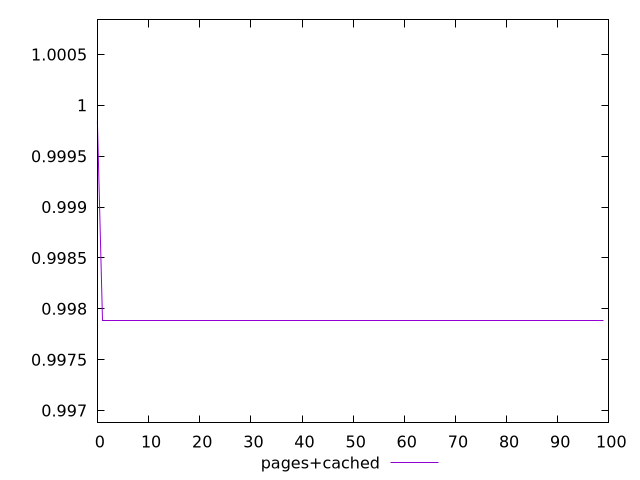
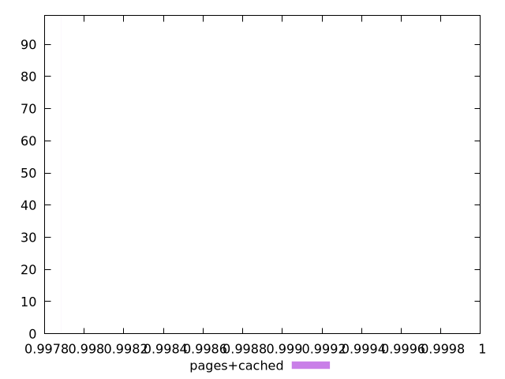
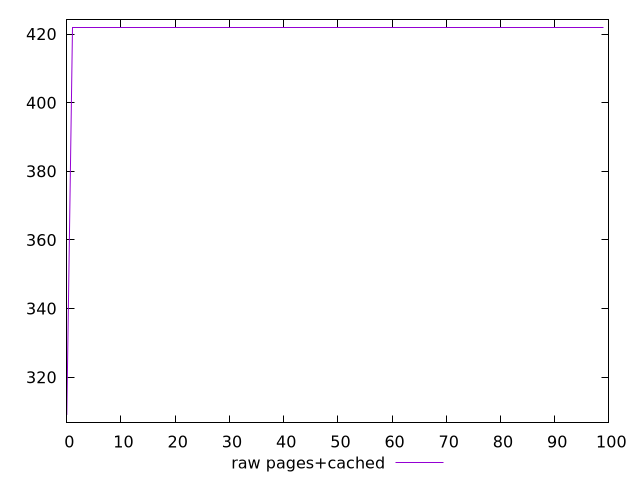
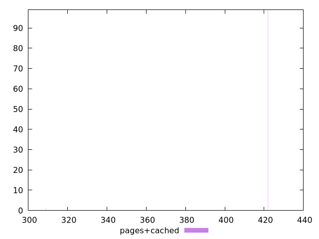

# Report pages+cached

[parent..](./..)  


## Scores

  

## Score Histogram

  

## Score Indicators

```yaml
min: 0.9978817385378554
max: 0.9998428513407445
range: 0.00196111280288902
mean: 0.997901349665885
median: 0.9978817385378554
stdev: 0.00019512826016235263
skewness: 9.84937058953082
eccentricity: 0.2010075630518992
quanta: 2
quantaRatio: 0.02
p90range: 0
p90stdev: 0.9978817385378554
p90eccentricity: 0.2010075630518992
p90quanta: 1
p90quantaRatio: 0.011111111111111112
outlandishness: 1.000039305901647

```

## Raw Values

  

## Raw Values Histogram

  

## Raw Indicators

```yaml
min: 309
max: 422
range: 113
mean: 420.87
median: 422
stdev: 11.243358039304805
skewness: -9.849370589540312
eccentricity: 0.20100756305184161
quanta: 2
quantaRatio: 0.02
p90range: 0
p90stdev: 422
p90eccentricity: 0.20100756305184161
p90quanta: 1
p90quantaRatio: 0.011111111111111112
outlandishness: 0.9946517199748434

```

<style>
  img {
    max-width: 80%;
  }
</style>
      
