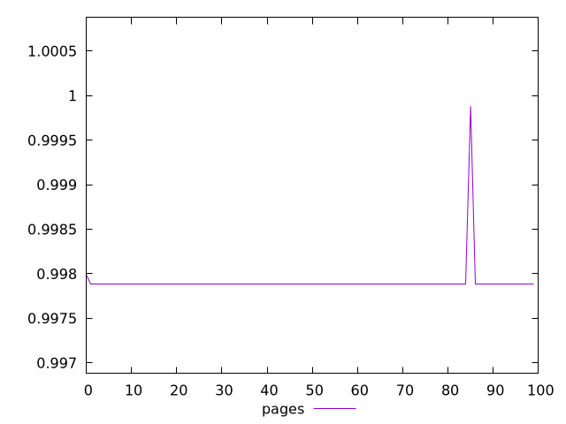
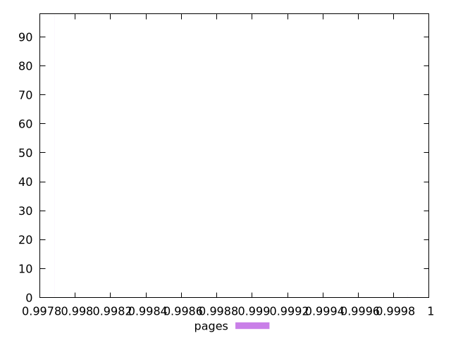
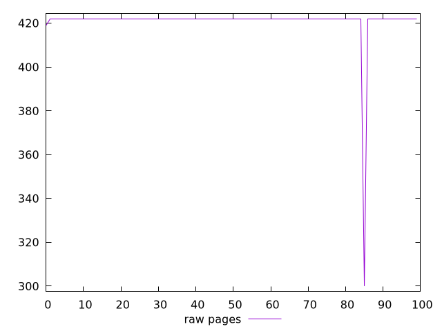
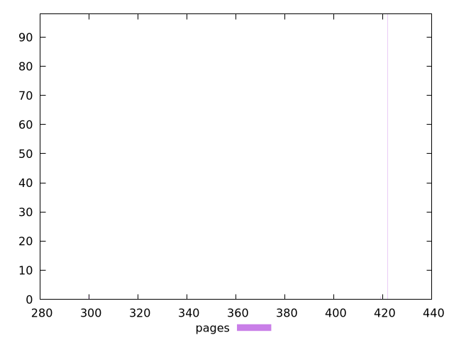

# Report pages

[parent..](./..)  


## Scores

  

## Score Histogram

  

## Score Indicators

```yaml
min: 0.9978817385378554
max: 0.9998804721468972
range: 0.0019987336090417918
mean: 0.9979028350644452
median: 0.9978817385378554
stdev: 0.00019906613805781802
skewness: 9.804752664854824
eccentricity: 0.2119549491941414
quanta: 3
quantaRatio: 0.03
p90range: 0
p90stdev: 0.9978817385378554
p90eccentricity: 0.2119549491941414
p90quanta: 1
p90quantaRatio: 0.011111111111111112
outlandishness: 1.000042283065775

```

## Raw Values

  

## Raw Values Histogram

  

## Raw Indicators

```yaml
min: 300
max: 422
range: 122
mean: 420.75
median: 422
stdev: 12.139501637217238
skewness: -9.840404454397436
eccentricity: 0.2059392613231757
quanta: 3
quantaRatio: 0.03
p90range: 0
p90stdev: 422
p90eccentricity: 0.2059392613231757
p90quanta: 1
p90quantaRatio: 0.011111111111111112
outlandishness: 0.9940846033332584

```

<style>
  img {
    max-width: 80%;
  }
</style>
      
