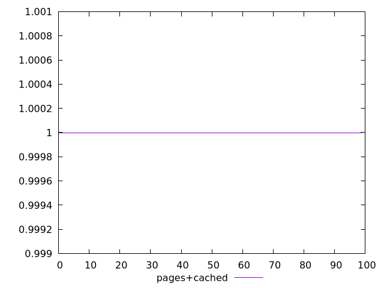
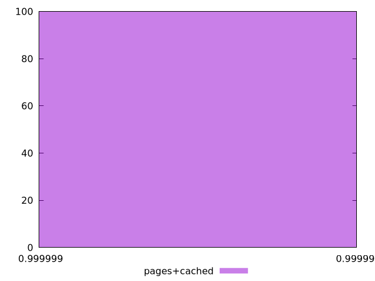
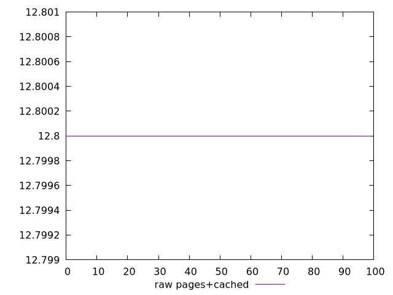
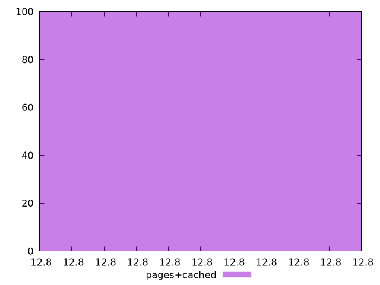

# Report pages+cached

[parent..](./..)  


## Scores

  

## Score Histogram

  

## Score Indicators

```yaml
min: 0.9999993380488856
max: 0.9999993380488856
range: 0
mean: 0.9999993380488845
median: 0.9999993380488856
stdev: 1.1102230246251565e-15
skewness: 1
eccentricity: 0
quanta: 1
quantaRatio: 0.01
p90range: 0
p90stdev: 0.9999993380488856
p90eccentricity: 0
p90quanta: 1
p90quantaRatio: 0.011111111111111112
outlandishness: 0.9999999999999989

```

## Raw Values

  

## Raw Values Histogram

  

## Raw Indicators

```yaml
min: 12.8
max: 12.8
range: 0
mean: 12.799999999999976
median: 12.8
stdev: 2.4868995751603507e-14
skewness: 1
eccentricity: 0
quanta: 1
quantaRatio: 0.01
p90range: 0
p90stdev: 12.8
p90eccentricity: 0
p90quanta: 1
p90quantaRatio: 0.011111111111111112
outlandishness: 0.9999999999999998

```

<style>
  img {
    max-width: 80%;
  }
</style>
      
