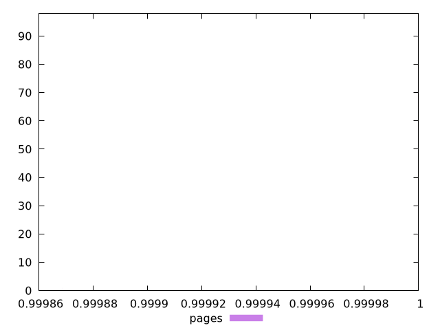
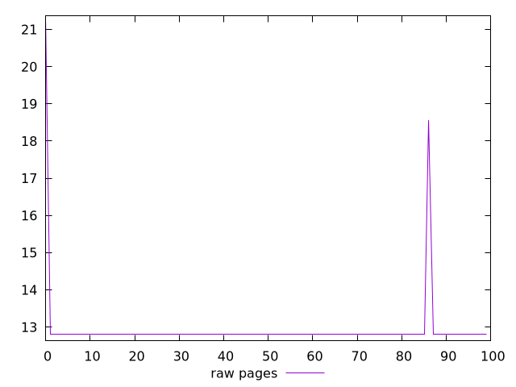
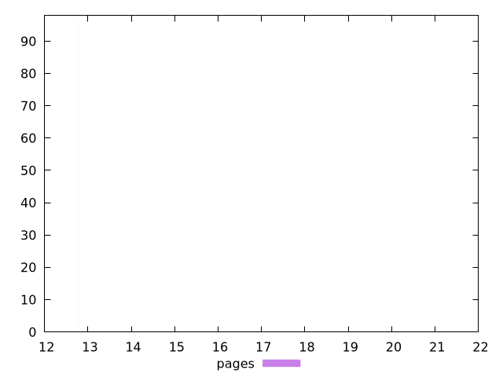

# Report pages

[parent..](./..)  


## Scores

  

## Score Histogram

  

## Score Indicators

```yaml
min: 0.999868516676541
max: 0.9999993380488856
range: 0.0001308213723446583
mean: 0.9999976650417769
median: 0.9999993380488856
stdev: 0.000013477788511772172
skewness: -8.968903930621172
eccentricity: 0.24826136815967842
quanta: 3
quantaRatio: 0.03
p90range: 0
p90stdev: 0.9999993380488856
p90eccentricity: 0.24826136815967842
p90quanta: 1
p90quantaRatio: 0.011111111111111112
outlandishness: 0.9999966539863677

```

## Raw Values

  

## Raw Values Histogram

  

## Raw Indicators

```yaml
min: 12.8
max: 21.200000000000003
range: 8.400000000000002
mean: 12.941599999999976
median: 12.8
stdev: 1.008625520200635
skewness: 7.214762556973234
eccentricity: 0.28077814246031185
quanta: 3
quantaRatio: 0.03
p90range: 0
p90stdev: 12.8
p90eccentricity: 0.28077814246031185
p90quanta: 1
p90quantaRatio: 0.011111111111111112
outlandishness: 1.02224737890625

```

<style>
  img {
    max-width: 80%;
  }
</style>
      
