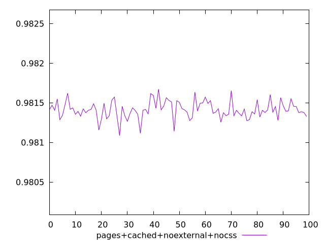
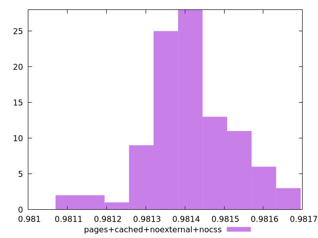
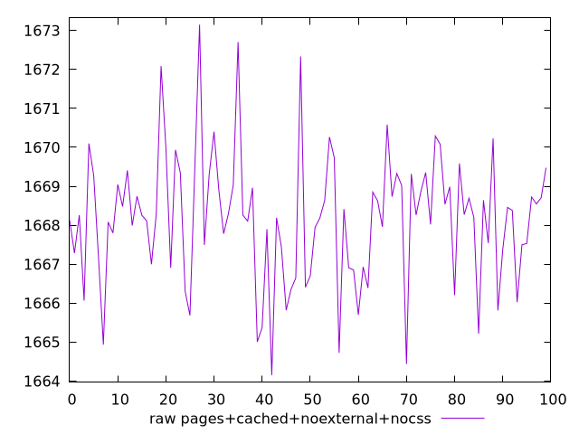
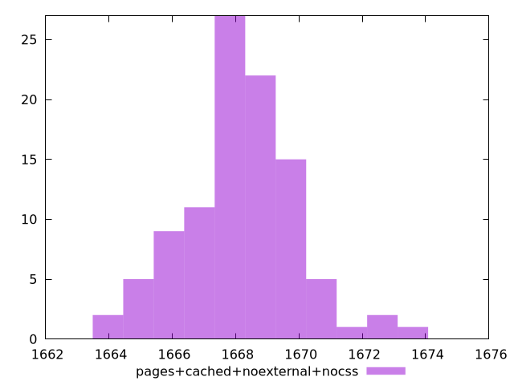

# Report pages+cached+noexternal+nocss

[parent..](./..)  


## Scores

  

## Score Histogram

  

## Score Indicators

```yaml
min: 0.9810871652402663
max: 0.9816727067019834
range: 0.0005855414617170762
mean: 0.9814132442444691
median: 0.9814067606556283
stdev: 0.00011006087597047359
skewness: -0.15092174444844558
eccentricity: 1.4856049709483847
quanta: 100
quantaRatio: 1
p90range: 0.0003383584183735966
p90stdev: 0.9814063446669987
p90eccentricity: 1.4856049709483847
p90quanta: 90
p90quantaRatio: 1
outlandishness: 1.0000039857416265

```

## Raw Values

  

## Raw Values Histogram

  

## Raw Indicators

```yaml
min: 1664.1504999999997
max: 1673.1508
range: 9.000300000000152
mean: 1668.1590290000004
median: 1668.2622000000001
stdev: 1.6932487651431924
skewness: 0.1351789044922684
eccentricity: 1.4860509877809351
quanta: 100
quantaRatio: 1
p90range: 5.20920000000001
p90stdev: 1668.2685999999999
p90eccentricity: 1.4860509877809351
p90quanta: 90
p90quantaRatio: 1
outlandishness: 0.9999620072363071

```

<style>
  img {
    max-width: 80%;
  }
</style>
      
