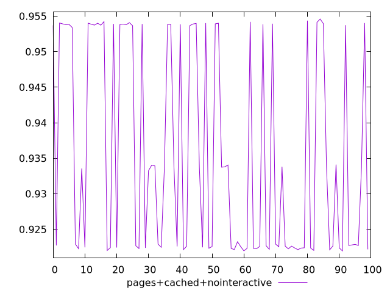
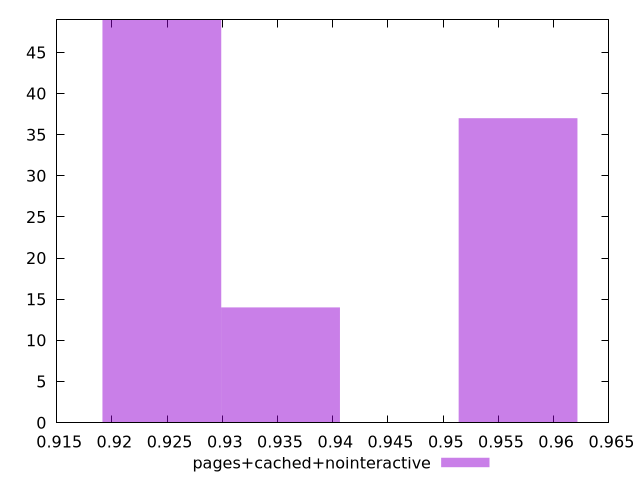
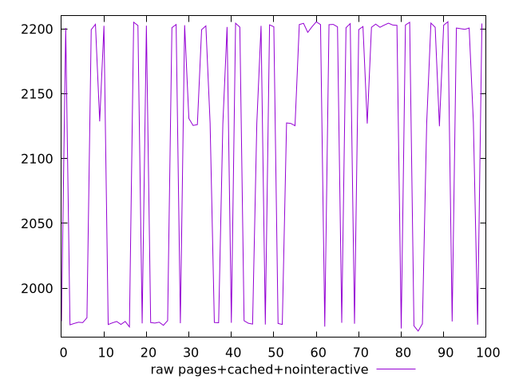
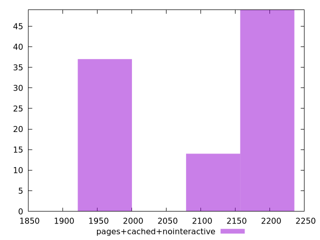

# Report pages+cached+nointeractive

[parent..](./..)  


## Scores

  

## Score Histogram

  

## Score Indicators

```yaml
min: 0.9219679058503829
max: 0.9546101949472406
range: 0.032642289096857735
mean: 0.9356954895760723
median: 0.933414146632165
stdev: 0.014473347047677807
skewness: 0.36561535402171397
eccentricity: 1.7988194531816988
quanta: 100
quantaRatio: 1
p90range: 0.03204892933373271
p90stdev: 0.9229029358413234
p90eccentricity: 1.7988194531816988
p90quanta: 90
p90quantaRatio: 1
outlandishness: 1.004405145731834

```

## Raw Values

  

## Raw Values Histogram

  

## Raw Indicators

```yaml
min: 1966.9283
max: 2205.583
range: 238.65470000000005
mean: 2106.902251
median: 2129.82715
stdev: 105.79991800052517
skewness: -0.39290271988521747
eccentricity: 1.77897066044102
quanta: 100
quantaRatio: 1
p90range: 233.5429999999999
p90stdev: 2199.6310999999996
p90eccentricity: 1.77897066044102
p90quanta: 90
p90quantaRatio: 1
outlandishness: 0.9857784917828099

```

<style>
  img {
    max-width: 80%;
  }
</style>
      
