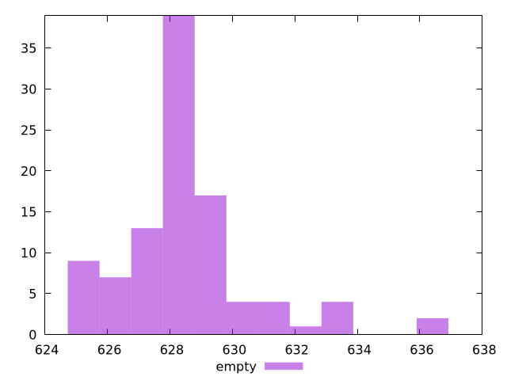

# Report empty

[parent..](./..)  


## Scores

  

## Score Histogram

  

## Score Indicators

```yaml
min: 0.9999996711806824
max: 0.9999997308073476
range: 5.962666516090565e-8
mean: 0.9999997143803497
median: 0.9999997158656355
stdev: 1.0583710221408645e-8
skewness: -1.528458300727415
eccentricity: 1.2597753227278679
quanta: 100
quantaRatio: 1
p90range: 3.040819807065276e-8
p90stdev: 0.9999997158794456
p90eccentricity: 1.2597753227278679
p90quanta: 90
p90quantaRatio: 1
outlandishness: 0.9999999966114568

```

## Raw Values

  

## Raw Values Histogram

  

## Raw Indicators

```yaml
min: 625.16225
max: 636.54885
range: 11.386600000000044
mean: 628.470438
median: 628.2082499999999
stdev: 2.0518513899052238
skewness: 1.3653662993665308
eccentricity: 1.2777894212511007
quanta: 100
quantaRatio: 1
p90range: 6.047400000000039
p90stdev: 628.2055
p90eccentricity: 1.2777894212511007
p90quanta: 90
p90quantaRatio: 1
outlandishness: 1.001009352215707

```

<style>
  img {
    max-width: 80%;
  }
</style>
      
