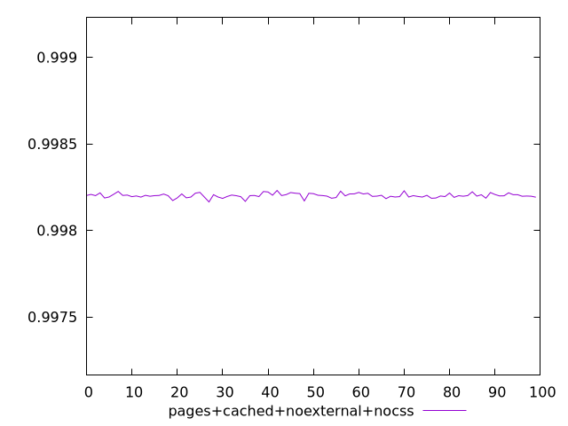
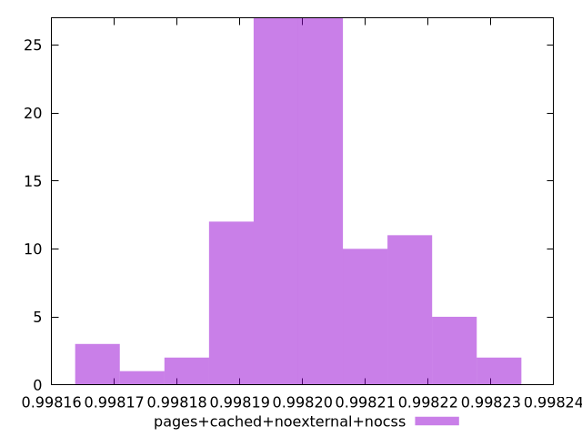
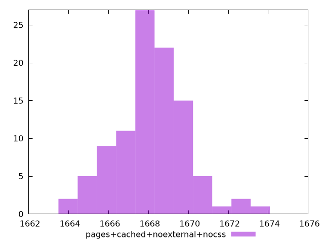

# Report pages+cached+noexternal+nocss

[parent..](./..)  


## Scores

  

## Score Histogram

  

## Score Indicators

```yaml
min: 0.9981639631185795
max: 0.9982305664949152
range: 0.00006660337633568325
mean: 0.9982011016492279
median: 0.998200372466377
stdev: 0.000012515433550652908
skewness: -0.15596853459114204
eccentricity: 1.4854561379346973
quanta: 100
quantaRatio: 1
p90range: 0.000038467168586020506
p90stdev: 0.9982003251635134
p90eccentricity: 1.4854561379346973
p90quanta: 90
p90quantaRatio: 1
outlandishness: 1.0000004380278158

```

## Raw Values

  

## Raw Values Histogram

  

## Raw Indicators

```yaml
min: 1664.1504999999997
max: 1673.1508
range: 9.000300000000152
mean: 1668.1590290000004
median: 1668.2622000000001
stdev: 1.6932487651431924
skewness: 0.1351789044922684
eccentricity: 1.4860509877809351
quanta: 100
quantaRatio: 1
p90range: 5.20920000000001
p90stdev: 1668.2685999999999
p90eccentricity: 1.4860509877809351
p90quanta: 90
p90quantaRatio: 1
outlandishness: 0.9999620072363071

```

<style>
  img {
    max-width: 80%;
  }
</style>
      
