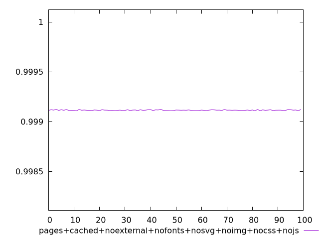
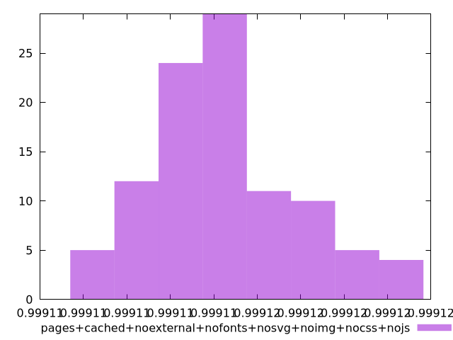

# Report pages+cached+noexternal+nofonts+nosvg+noimg+nocss+nojs

[parent..](./..)  


## Scores

  

## Score Histogram

  

## Score Indicators

```yaml
min: 0.9991079629833008
max: 0.9991227705354161
range: 0.00001480755211524798
mean: 0.9991144765889511
median: 0.9991140631978572
stdev: 0.0000033609259770478938
skewness: 0.5566618216256468
eccentricity: 1.5720413983777675
quanta: 99
quantaRatio: 0.99
p90range: 0.000011342293525506975
p90stdev: 0.9991137341131825
p90eccentricity: 1.5720413983777675
p90quanta: 89
p90quantaRatio: 0.9888888888888889
outlandishness: 1.000000993912518

```

## Raw Values

  

## Raw Values Histogram

  

## Raw Indicators

```yaml
min: 1506.9898
max: 1510.459
range: 3.4692000000000007
mean: 1508.9373759999999
median: 1509.0353
stdev: 0.7874440329471022
skewness: -0.5632224666911744
eccentricity: 1.5712913530743395
quanta: 99
quantaRatio: 0.99
p90range: 2.654600000000073
p90stdev: 1509.1122999999998
p90eccentricity: 1.5712913530743395
p90quanta: 89
p90quantaRatio: 0.9888888888888889
outlandishness: 0.9998453754805163

```

<style>
  img {
    max-width: 80%;
  }
</style>
      
