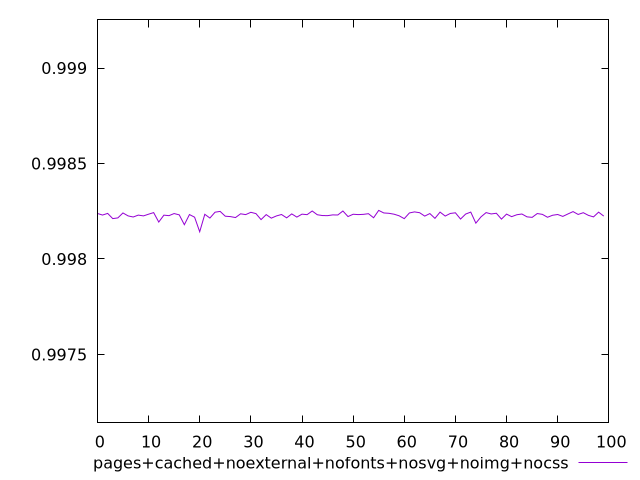
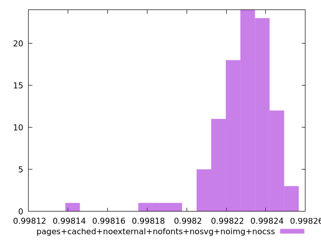
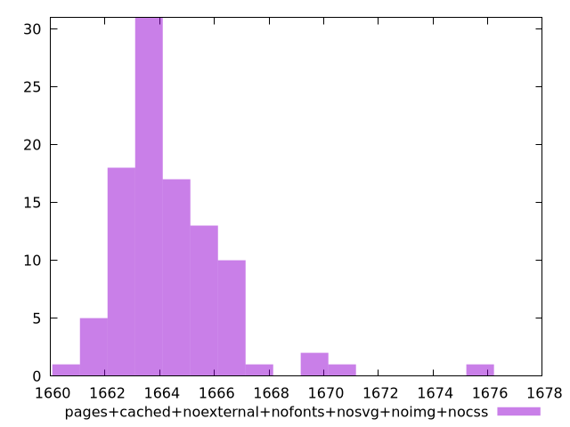

# Report pages+cached+noexternal+nofonts+nosvg+noimg+nocss

[parent..](./..)  


## Scores

  

## Score Histogram

  

## Score Indicators

```yaml
min: 0.9981426585354668
max: 0.9982543546626861
range: 0.00011169612721928512
mean: 0.9982287912299779
median: 0.9982322239257178
stdev: 0.000015541683848488764
skewness: -2.1971919889783584
eccentricity: 1.3481517113384929
quanta: 100
quantaRatio: 1
p90range: 0.000039150288045908255
p90stdev: 0.9982323806762237
p90eccentricity: 1.3481517113384929
p90quanta: 90
p90quantaRatio: 1
outlandishness: 0.9999963587670297

```

## Raw Values

  

## Raw Values Histogram

  

## Raw Indicators

```yaml
min: 1660.8732000000005
max: 1675.9770999999996
range: 15.103899999999157
mean: 1664.38667
median: 1663.92325
stdev: 2.1133377263229476
skewness: 2.1389873707373344
eccentricity: 1.3551227351544197
quanta: 100
quantaRatio: 1
p90range: 5.361699999999928
p90stdev: 1663.90175
p90eccentricity: 1.3551227351544197
p90quanta: 90
p90quantaRatio: 1
outlandishness: 1.0002939815471725

```

<style>
  img {
    max-width: 80%;
  }
</style>
      
