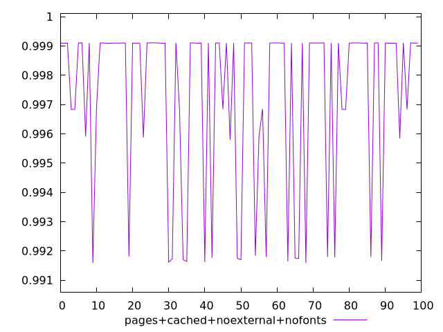

# Report pages+cached+noexternal+nofonts

[parent..](./..)  


## Scores

  

## Score Histogram

  

## Score Indicators

```yaml
min: 0.9915853859990458
max: 0.9991080935823182
range: 0.007522707583272448
mean: 0.9972576107969013
median: 0.9990980061937385
stdev: 0.002915526053835627
skewness: -1.2141528223443718
eccentricity: 1.2651777645807596
quanta: 100
quantaRatio: 1
p90range: 0.00736573737627233
p90stdev: 0.999098824752476
p90eccentricity: 1.2651777645807596
p90quanta: 90
p90quantaRatio: 1
outlandishness: 0.9987513578317404

```

## Raw Values

  

## Raw Values Histogram

  

## Raw Indicators

```yaml
min: 1510.4286000000002
max: 2127.8655
range: 617.4368999999997
mean: 1680.5527344999991
median: 1512.7665
stdev: 248.21882781082724
skewness: 0.9668443775703501
eccentricity: 1.359253639120131
quanta: 100
quantaRatio: 1
p90range: 610.5820999999996
p90stdev: 1512.5775499999997
p90eccentricity: 1.359253639120131
p90quanta: 90
p90quantaRatio: 1
outlandishness: 1.0614802243177213

```

<style>
  img {
    max-width: 80%;
  }
</style>
      
