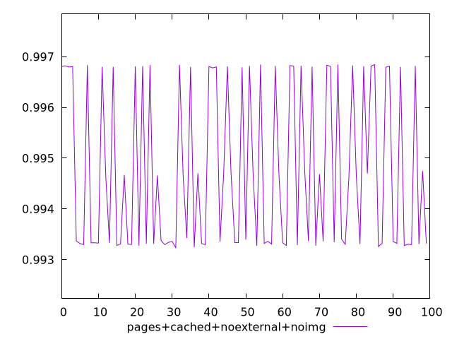
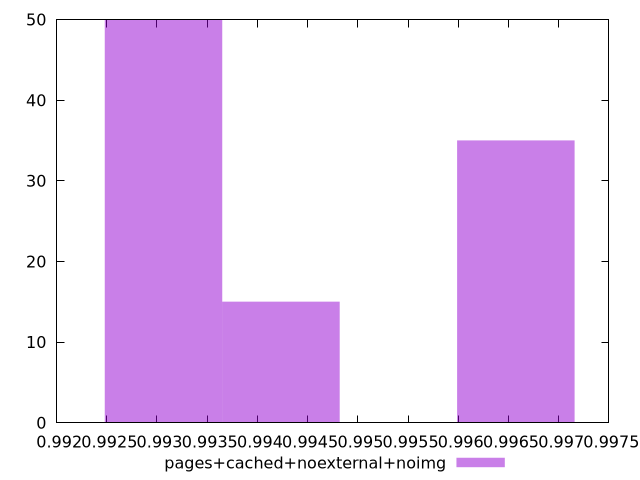
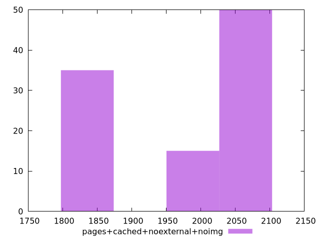

# Report pages+cached+noexternal+noimg

[parent..](./..)  


## Scores

  

## Score Histogram

  

## Score Indicators

```yaml
min: 0.9932353217589898
max: 0.9968452734058874
range: 0.003609951646897591
mean: 0.9947472154613828
median: 0.9940319787226831
stdev: 0.0015857310810349955
skewness: 0.4095918247990038
eccentricity: 1.7998341551103307
quanta: 100
quantaRatio: 1
p90range: 0.003584041178770314
p90stdev: 0.9933684029347547
p90eccentricity: 1.7998341551103307
p90quanta: 90
p90quantaRatio: 1
outlandishness: 1.0004665292244739

```

## Raw Values

  

## Raw Values Histogram

  

## Raw Indicators

```yaml
min: 1814.6572999999999
max: 2050.66715
range: 236.00985000000037
mean: 1954.910144499999
median: 2007.2413000000001
stdev: 104.09824085459968
skewness: -0.4665481610816978
eccentricity: 1.7566762271748821
quanta: 100
quantaRatio: 1
p90range: 233.72235000000046
p90stdev: 2043.8761999999997
p90eccentricity: 1.7566762271748821
p90quanta: 90
p90quantaRatio: 1
outlandishness: 0.9843479223286626

```

<style>
  img {
    max-width: 80%;
  }
</style>
      
