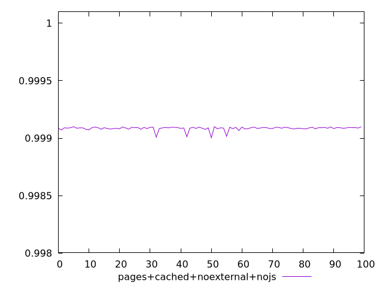
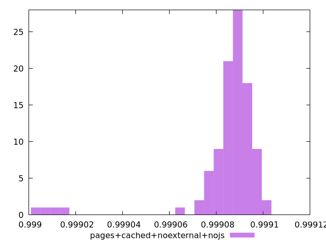
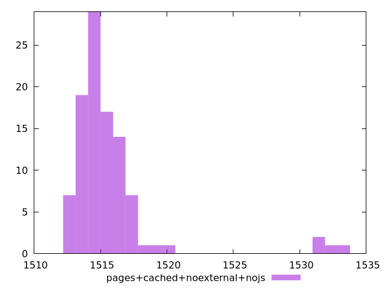

# Report pages+cached+noexternal+nojs

[parent..](./..)  


## Scores

  

## Score Histogram

  

## Score Indicators

```yaml
min: 0.9990037462007441
max: 0.9991001576074825
range: 0.00009641140673843918
mean: 0.9990850058187274
median: 0.9990888734059369
stdev: 0.00001656753216421077
skewness: -3.6970662773218925
eccentricity: 0.9576289351682651
quanta: 100
quantaRatio: 1
p90range: 0.00002109774927816499
p90stdev: 0.9990892018299831
p90eccentricity: 0.9576289351682651
p90quanta: 90
p90quantaRatio: 1
outlandishness: 0.9999932817311932

```

## Raw Values

  

## Raw Values Histogram

  

## Raw Indicators

```yaml
min: 1512.2695999999999
max: 1533.681
range: 21.411400000000185
mean: 1515.7238659999994
median: 1514.8656
stdev: 3.6865714581225815
skewness: 3.6442227930522377
eccentricity: 0.9718699449338823
quanta: 100
quantaRatio: 1
p90range: 4.821600000000217
p90stdev: 1514.7904
p90eccentricity: 0.9718699449338823
p90quanta: 90
p90quantaRatio: 1
outlandishness: 1.000982308229878

```

<style>
  img {
    max-width: 80%;
  }
</style>
      
