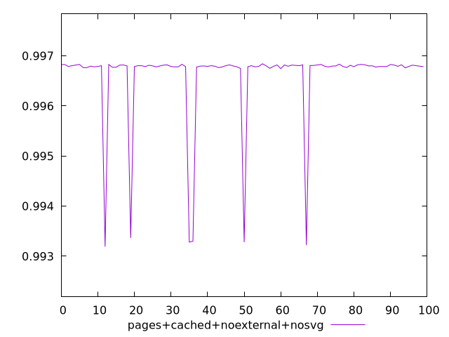
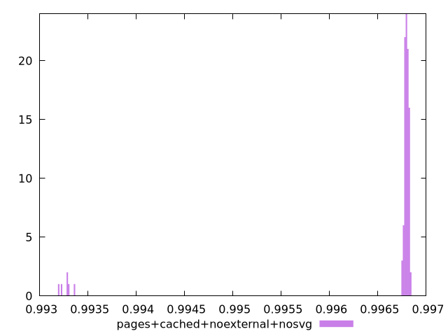
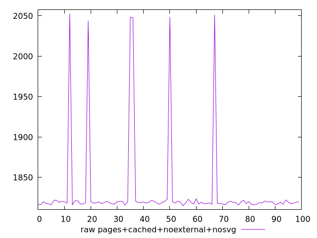
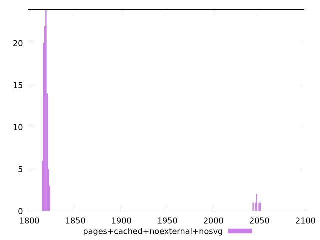

# Report pages+cached+noexternal+nosvg

[parent..](./..)  


## Scores

  

## Score Histogram

  

## Score Indicators

```yaml
min: 0.9931916248808736
max: 0.9968414604883424
range: 0.0036498356074687877
mean: 0.996586353565299
median: 0.9967951128926033
stdev: 0.0008373123796780195
skewness: -3.7037054359915316
eccentricity: 0.541817838284884
quanta: 100
quantaRatio: 1
p90range: 0.00008427892348472632
p90stdev: 0.996796845168547
p90eccentricity: 0.541817838284884
p90quanta: 90
p90quantaRatio: 1
outlandishness: 0.9995789692731648

```

## Raw Values

  

## Raw Values Histogram

  

## Raw Indicators

```yaml
min: 1814.9948000000002
max: 2052.8760500000003
range: 237.88125000000014
mean: 1832.6259929999997
median: 1819.07315
stdev: 54.62628207524794
skewness: 3.700295103089751
eccentricity: 0.5542924184056782
quanta: 100
quantaRatio: 1
p90range: 7.361000000000104
p90stdev: 1818.9215000000002
p90eccentricity: 0.5542924184056782
p90quanta: 90
p90quantaRatio: 1
outlandishness: 1.0150682779811353

```

<style>
  img {
    max-width: 80%;
  }
</style>
      
