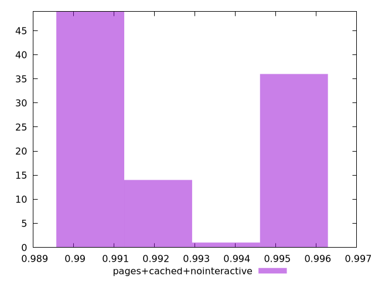

# Report pages+cached+nointeractive

[parent..](./..)  


## Scores

  

## Score Histogram

  

## Score Indicators

```yaml
min: 0.9896559295246983
max: 0.9947478220338701
range: 0.005091892509171858
mean: 0.9918177842013586
median: 0.99154005254557
stdev: 0.0022575205267004166
skewness: 0.3491343313974312
eccentricity: 1.8098809236106927
quanta: 100
quantaRatio: 1
p90range: 0.005007360651353321
p90stdev: 0.9898136552603858
p90eccentricity: 1.8098809236106927
p90quanta: 90
p90quantaRatio: 1
outlandishness: 1.0006431650156105

```

## Raw Values

  

## Raw Values Histogram

  

## Raw Indicators

```yaml
min: 1966.9283
max: 2205.583
range: 238.65470000000005
mean: 2106.902251
median: 2129.82715
stdev: 105.79991800052517
skewness: -0.39290271988521747
eccentricity: 1.77897066044102
quanta: 100
quantaRatio: 1
p90range: 233.5429999999999
p90stdev: 2199.6310999999996
p90eccentricity: 1.77897066044102
p90quanta: 90
p90quantaRatio: 1
outlandishness: 0.9857784917828099

```

<style>
  img {
    max-width: 80%;
  }
</style>
      
