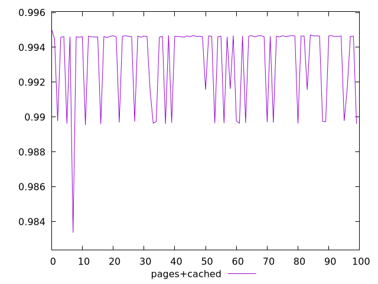
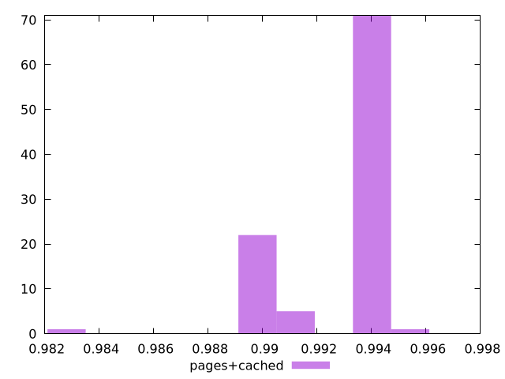
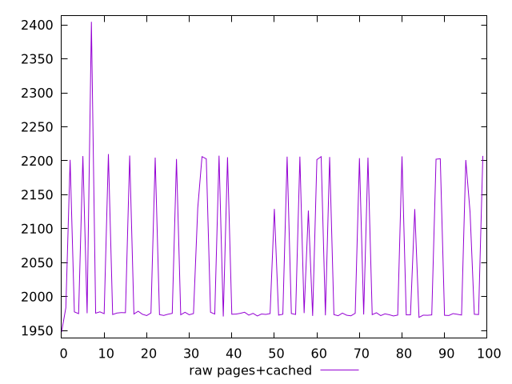
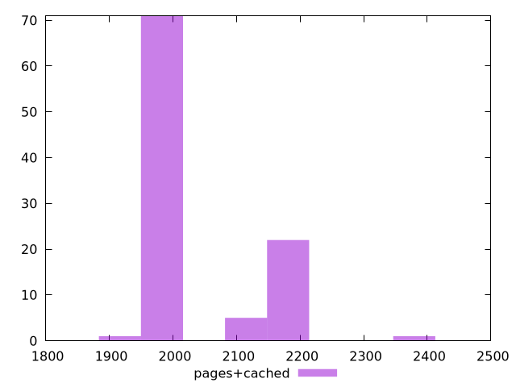

# Report pages+cached

[parent..](./..)  


## Scores

  

## Score Histogram

  

## Score Indicators

```yaml
min: 0.9833619866068815
max: 0.9950528285962085
range: 0.011690841989327017
mean: 0.9932778010071476
median: 0.9946145828239128
stdev: 0.002304470473502295
skewness: -1.5106400719722524
eccentricity: 1.1939115726481426
quanta: 100
quantaRatio: 1
p90range: 0.005408358197183549
p90stdev: 0.9946230656431563
p90eccentricity: 1.1939115726481426
p90quanta: 90
p90quantaRatio: 1
outlandishness: 0.9990416974740859

```

## Raw Values

  

## Raw Values Histogram

  

## Raw Indicators

```yaml
min: 1947.971
max: 2404.5526000000004
range: 456.58160000000044
mean: 2036.6339199999995
median: 1974.9586999999997
stdev: 104.17382912592444
skewness: 1.241614500378301
eccentricity: 1.229082669556356
quanta: 100
quantaRatio: 1
p90range: 258.0419499999998
p90stdev: 1974.4517500000002
p90eccentricity: 1.229082669556356
p90quanta: 90
p90quantaRatio: 1
outlandishness: 1.0210767003967522

```

<style>
  img {
    max-width: 80%;
  }
</style>
      
