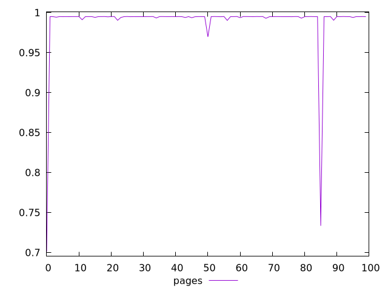
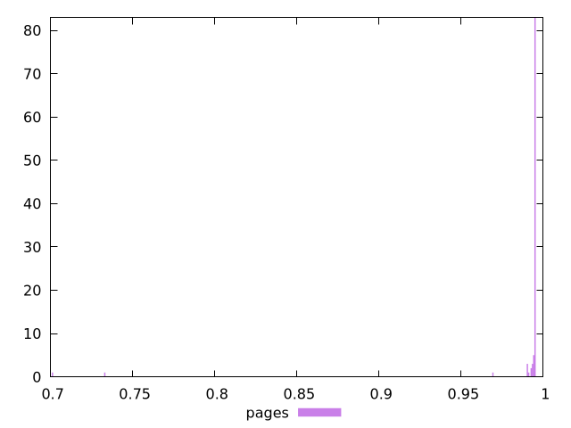
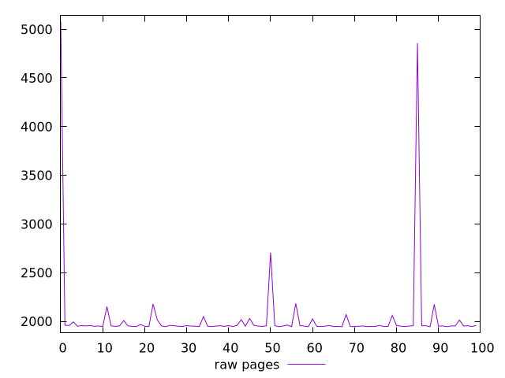
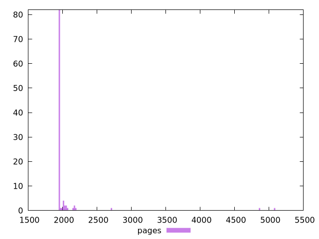

# Report pages

[parent..](./..)  


## Scores

  

## Score Histogram

  

## Score Indicators

```yaml
min: 0.701132553722267
max: 0.9950993763763162
range: 0.29396682265404916
mean: 0.9888701509729326
median: 0.9949758996661808
stdev: 0.03896464917322057
skewness: -6.846028423128624
eccentricity: 0.3168431885682204
quanta: 100
quantaRatio: 1
p90range: 0.004877721977491256
p90stdev: 0.994971253862664
p90eccentricity: 0.3168431885682204
p90quanta: 90
p90quantaRatio: 1
outlandishness: 0.9884391831066609

```

## Raw Values

  

## Raw Values Histogram

  

## Raw Indicators

```yaml
min: 1945.0035000000003
max: 5079.971500000001
range: 3134.9680000000003
mean: 2036.17191
median: 1952.831
stdev: 428.4386590861485
skewness: 6.479045360167381
eccentricity: 0.4088454117880591
quanta: 100
quantaRatio: 1
p90range: 124.10100000000011
p90stdev: 1952.2882499999996
p90eccentricity: 0.4088454117880591
p90quanta: 90
p90quantaRatio: 1
outlandishness: 1.0786656622793331

```

<style>
  img {
    max-width: 80%;
  }
</style>
      
