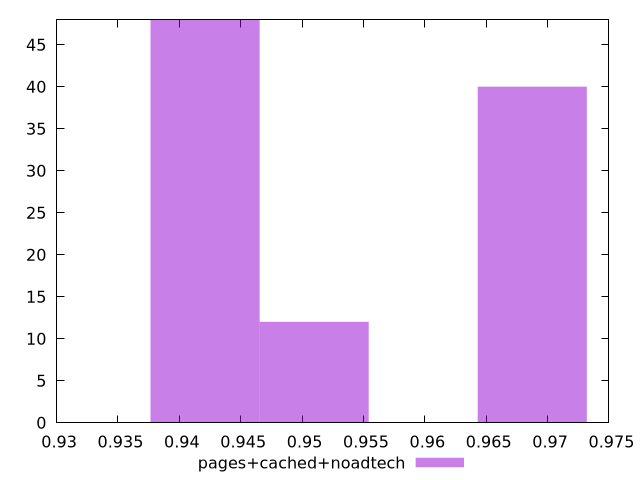

# Report pages+cached+noadtech

[parent..](./..)  


## Scores

  

## Score Histogram

  

## Score Indicators

```yaml
min: 0.943734639643558
max: 0.9700626996635401
range: 0.026328060019982114
mean: 0.955637198031614
median: 0.953464844097843
stdev: 0.01183282879333653
skewness: 0.25929675678504754
eccentricity: 1.8358369109908612
quanta: 100
quantaRatio: 1
p90range: 0.026123526163104205
p90stdev: 0.945134418938745
p90eccentricity: 1.8358369109908612
p90quanta: 90
p90quantaRatio: 1
outlandishness: 1.003339144973529

```

## Raw Values

  

## Raw Values Histogram

  

## Raw Indicators

```yaml
min: 1815.857
max: 2055.00835
range: 239.1513500000001
mean: 1948.8976089999994
median: 1976.7597
stdev: 107.80329128230348
skewness: -0.28813901632440425
eccentricity: 1.8180406522724843
quanta: 100
quantaRatio: 1
p90range: 236.86154999999962
p90stdev: 2044.2707500000001
p90eccentricity: 1.8180406522724843
p90quanta: 90
p90quantaRatio: 1
outlandishness: 0.9851281367222261

```

<style>
  img {
    max-width: 80%;
  }
</style>
      
