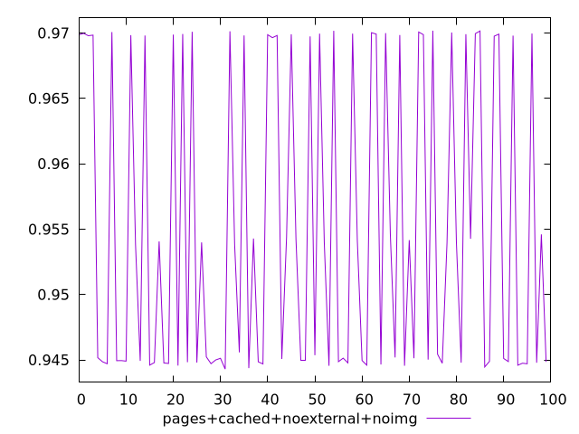
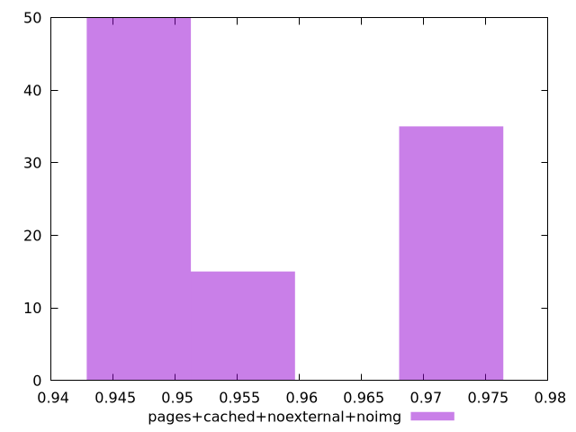
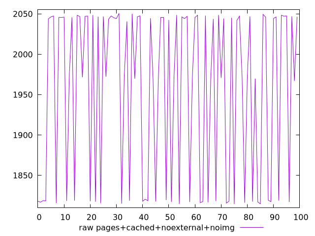
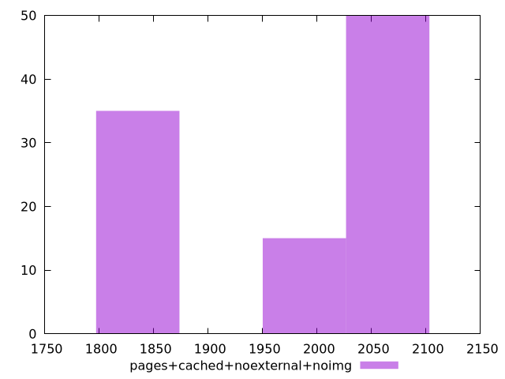

# Report pages+cached+noexternal+noimg

[parent..](./..)  


## Scores

  

## Score Histogram

  

## Score Indicators

```yaml
min: 0.9443030417368379
max: 0.9701695035748684
range: 0.02586646183803054
mean: 0.9550275695317465
median: 0.9497037814825664
stdev: 0.011377096708323313
skewness: 0.42836700445556536
eccentricity: 1.786415962082513
quanta: 100
quantaRatio: 1
p90range: 0.025662603237408432
p90stdev: 0.9451854723966114
p90eccentricity: 1.786415962082513
p90quanta: 90
p90quantaRatio: 1
outlandishness: 1.0035134491506221

```

## Raw Values

  

## Raw Values Histogram

  

## Raw Indicators

```yaml
min: 1814.6572999999999
max: 2050.66715
range: 236.00985000000037
mean: 1954.910144499999
median: 2007.2413000000001
stdev: 104.09824085459968
skewness: -0.4665481610816978
eccentricity: 1.7566762271748821
quanta: 100
quantaRatio: 1
p90range: 233.72235000000046
p90stdev: 2043.8761999999997
p90eccentricity: 1.7566762271748821
p90quanta: 90
p90quantaRatio: 1
outlandishness: 0.9843479223286626

```

<style>
  img {
    max-width: 80%;
  }
</style>
      
