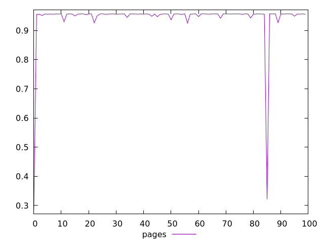
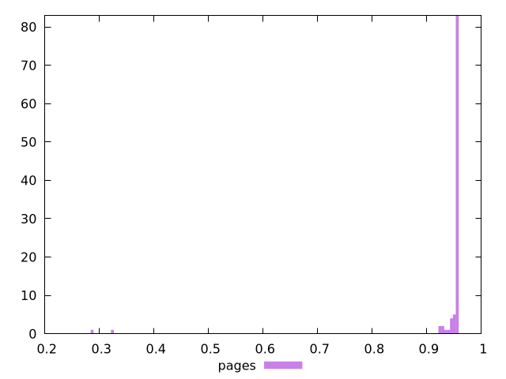
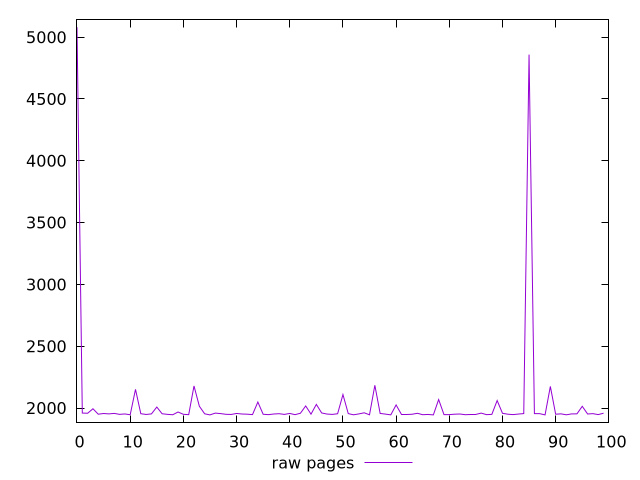
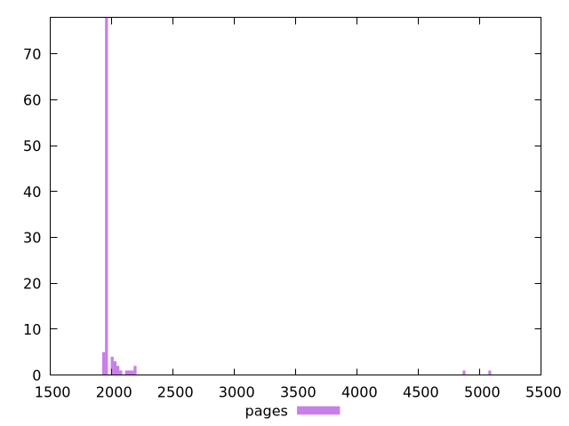

# Report pages

[parent..](./..)  


## Scores

  

## Score Histogram

  

## Score Indicators

```yaml
min: 0.28451012032679907
max: 0.957102437565996
range: 0.672592317239197
mean: 0.9409793690555461
median: 0.9562224824038881
stdev: 0.09141066134685724
skewness: -6.812427089792224
eccentricity: 0.34396075001224824
quanta: 100
quantaRatio: 1
p90range: 0.031726463897179036
p90stdev: 0.9561748178965309
p90eccentricity: 0.34396075001224824
p90quanta: 90
p90quantaRatio: 1
outlandishness: 0.9734444441835554

```

## Raw Values

  

## Raw Values Histogram

  

## Raw Indicators

```yaml
min: 1945.0035000000003
max: 5079.971500000001
range: 3134.9680000000003
mean: 2030.2041499999998
median: 1952.831
stdev: 423.1866824379077
skewness: 6.725926888849013
eccentricity: 0.38571549336019045
quanta: 100
quantaRatio: 1
p90range: 163.90949999999998
p90stdev: 1952.5927499999998
p90eccentricity: 0.38571549336019045
p90quanta: 90
p90quantaRatio: 1
outlandishness: 1.0703571715455658

```

<style>
  img {
    max-width: 80%;
  }
</style>
      
