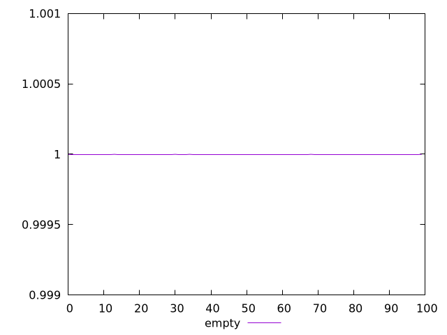
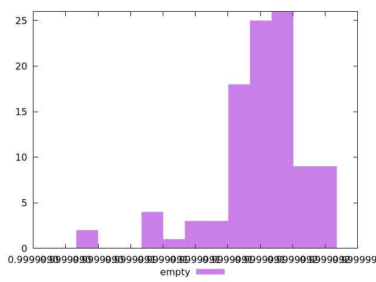

# Report empty

[parent..](./..)  


## Scores

  

## Score Histogram

  

## Score Indicators

```yaml
min: 0.9999990303204299
max: 0.9999991860275903
range: 1.55707160387486e-7
mean: 0.9999991428036235
median: 0.9999991466423142
stdev: 2.7696935540474534e-8
skewness: -1.505214384518351
eccentricity: 1.2624065899979628
quanta: 100
quantaRatio: 1
p90range: 7.987165773215565e-8
p90stdev: 0.9999991466785965
p90eccentricity: 1.2624065899979628
p90quanta: 90
p90quantaRatio: 1
outlandishness: 0.9999999911756445

```

## Raw Values

  

## Raw Values Histogram

  

## Raw Indicators

```yaml
min: 625.16225
max: 636.54885
range: 11.386600000000044
mean: 628.470438
median: 628.2082499999999
stdev: 2.0518513899052238
skewness: 1.3653662993665308
eccentricity: 1.2777894212511007
quanta: 100
quantaRatio: 1
p90range: 6.047400000000039
p90stdev: 628.2055
p90eccentricity: 1.2777894212511007
p90quanta: 90
p90quantaRatio: 1
outlandishness: 1.001009352215707

```

<style>
  img {
    max-width: 80%;
  }
</style>
      
