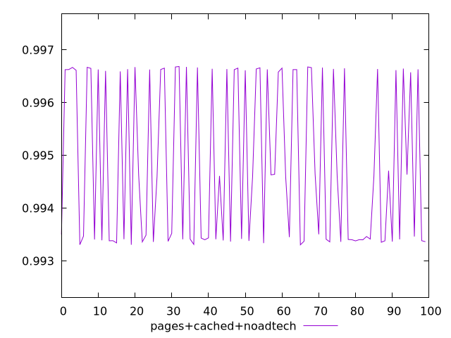
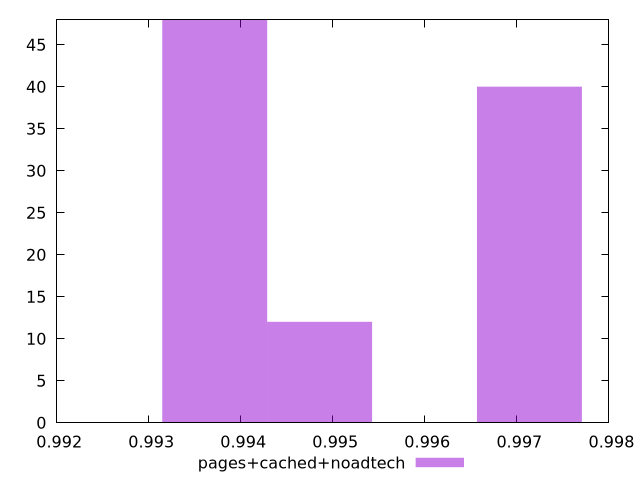
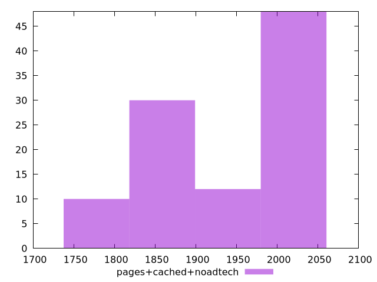

# Report pages+cached+noadtech

[parent..](./..)  


## Scores

  

## Score Histogram

  

## Score Indicators

```yaml
min: 0.9933050876219027
max: 0.9966824254944384
range: 0.0033773378725356906
mean: 0.9948407077837667
median: 0.9945979571079092
stdev: 0.0015162479715706675
skewness: 0.24994582764716242
eccentricity: 1.8410787341051513
quanta: 100
quantaRatio: 1
p90range: 0.003352627495620264
p90stdev: 0.9934941782791326
p90eccentricity: 1.8410787341051513
p90quanta: 90
p90quantaRatio: 1
outlandishness: 1.000408771311261

```

## Raw Values

  

## Raw Values Histogram

  

## Raw Indicators

```yaml
min: 1815.857
max: 2055.00835
range: 239.1513500000001
mean: 1948.8976089999994
median: 1976.7597
stdev: 107.80329128230348
skewness: -0.28813901632440425
eccentricity: 1.8180406522724843
quanta: 100
quantaRatio: 1
p90range: 236.86154999999962
p90stdev: 2044.2707500000001
p90eccentricity: 1.8180406522724843
p90quanta: 90
p90quantaRatio: 1
outlandishness: 0.9851281367222261

```

<style>
  img {
    max-width: 80%;
  }
</style>
      
