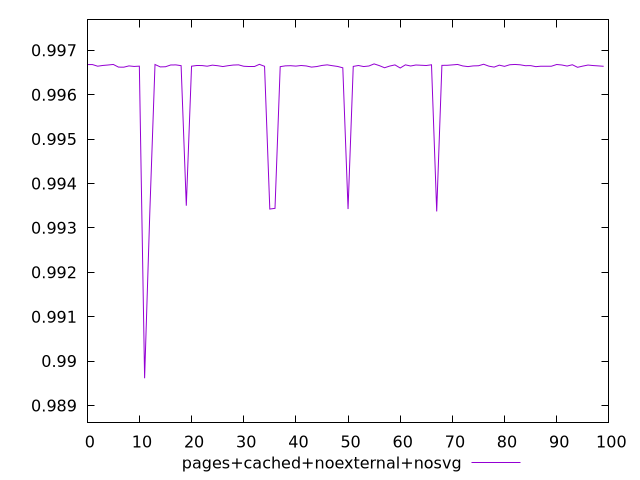
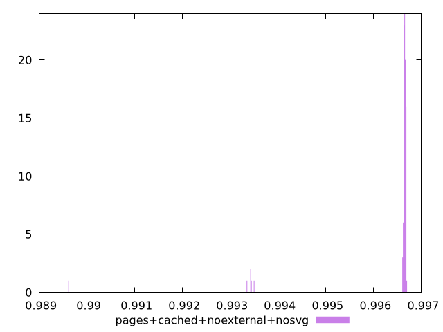
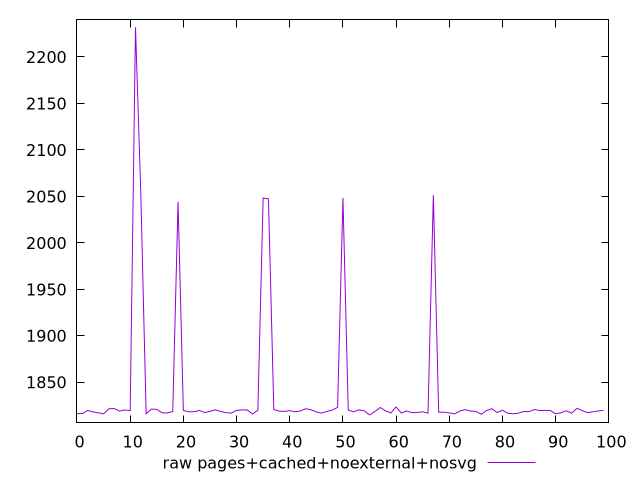
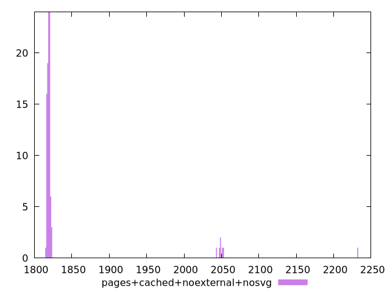

# Report pages+cached+noexternal+nosvg

[parent..](./..)  


## Scores

  

## Score Histogram

  

## Score Indicators

```yaml
min: 0.9896137682078787
max: 0.9966916953014598
range: 0.007077927093581127
mean: 0.9963857832852281
median: 0.9966470914961757
stdev: 0.001026269484323675
skewness: -4.311975187405006
eccentricity: 0.5435036421780378
quanta: 100
quantaRatio: 1
p90range: 0.00008013131774131654
p90stdev: 0.996649324497455
p90eccentricity: 0.5435036421780378
p90quanta: 90
p90quantaRatio: 1
outlandishness: 0.9994718729655577

```

## Raw Values

  

## Raw Values Histogram

  

## Raw Indicators

```yaml
min: 1814.9948000000002
max: 2231.929
range: 416.9341999999999
mean: 1836.7618509999998
median: 1819.1274499999997
stdev: 67.52269473445209
skewness: 3.8434080165441857
eccentricity: 0.5704697383818467
quanta: 100
quantaRatio: 1
p90range: 7.375999999999749
p90stdev: 1818.9215000000002
p90eccentricity: 0.5704697383818467
p90quanta: 90
p90quantaRatio: 1
outlandishness: 1.0196824872516386

```

<style>
  img {
    max-width: 80%;
  }
</style>
      
