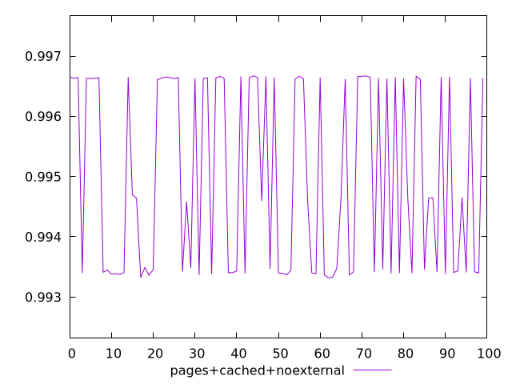
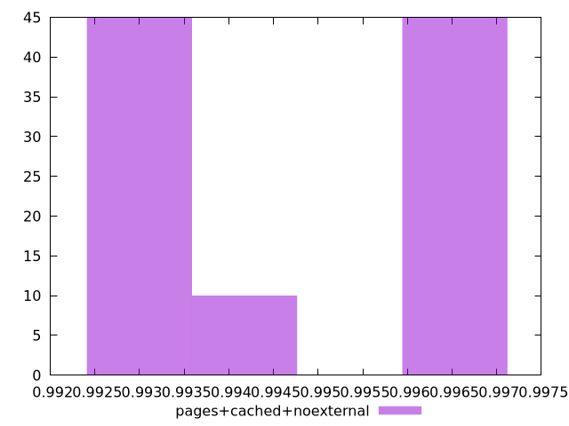
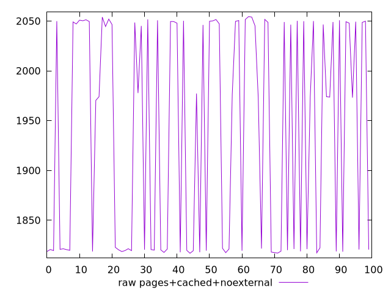

# Report pages+cached+noexternal

[parent..](./..)  


## Scores

  

## Score Histogram

  

## Score Indicators

```yaml
min: 0.9933164666291344
max: 0.9966719546463649
range: 0.0033554880172305124
mean: 0.9949840403903076
median: 0.9946418065652021
stdev: 0.001540300083599472
skewness: 0.07311632774515686
eccentricity: 1.8946150894715224
quanta: 100
quantaRatio: 1
p90range: 0.0033369051618935552
p90stdev: 0.994037542620648
p90eccentricity: 1.8946150894715224
p90quanta: 90
p90quantaRatio: 1
outlandishness: 1.0003752596402247

```

## Raw Values

  

## Raw Values Histogram

  

## Raw Indicators

```yaml
min: 1816.8288000000002
max: 2054.36825
range: 237.53944999999976
mean: 1938.5034780000008
median: 1973.8833
stdev: 109.65505452247588
skewness: -0.10375359337351027
eccentricity: 1.8885963159824253
quanta: 100
quantaRatio: 1
p90range: 235.82025000000044
p90stdev: 2011.0593499999998
p90eccentricity: 1.8885963159824253
p90quanta: 90
p90quantaRatio: 1
outlandishness: 0.986281407904368

```

<style>
  img {
    max-width: 80%;
  }
</style>
      
